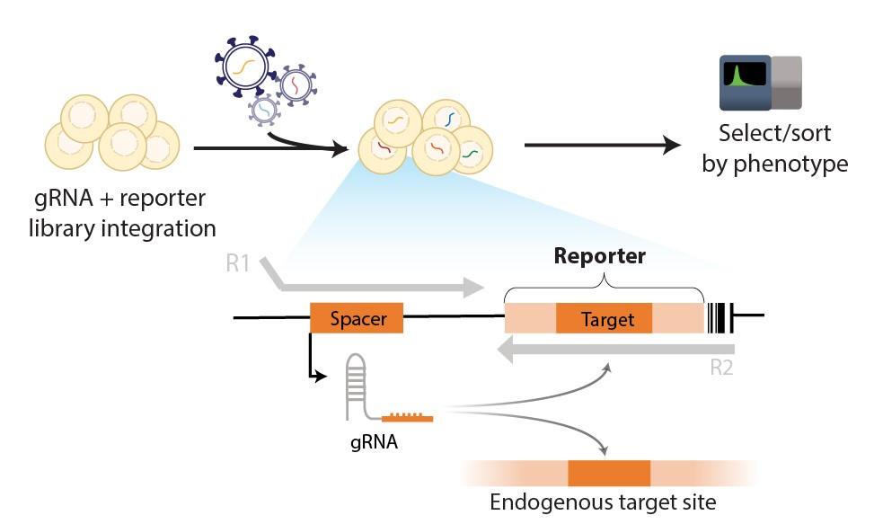
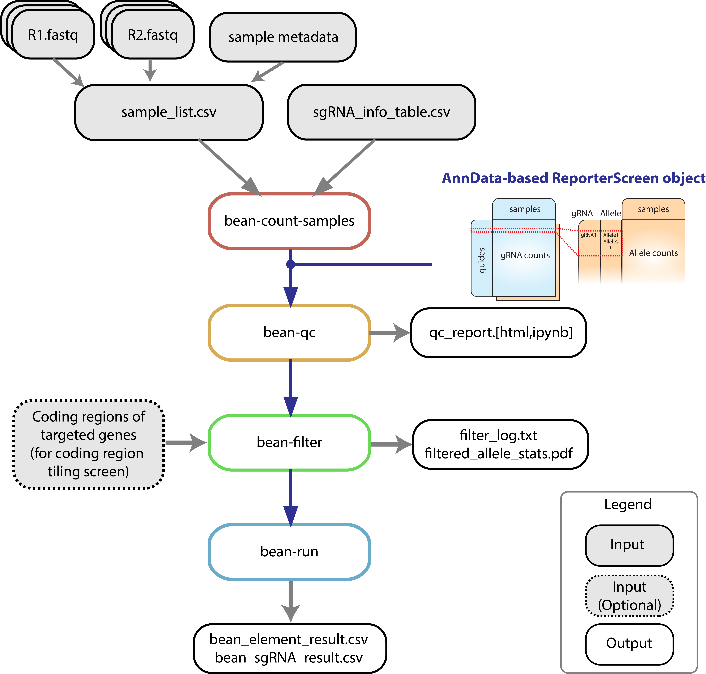
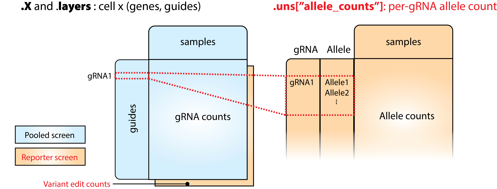

# 

[](https://pypi.org/project/crispr-bean/)
[](https://pypi.org/project/crispr-bean/)
[](https://github.com/psf/black)

**CRISPR** **B**ayesian **E**stimation of variant effect (from **B**ase **E**diting reporter screens) with guide **A**ctivity **N**ormalization  
This is an analysis toolkit for the pooled CRISPR reporter or sensor data. The reporter technique transfects cells with plasmid with not only sgRNA but with the **target sequence surrogate** which we call **reporter** or **sensor**.  




## Overview
`crispr-bean` supports end-to-end analysis of pooled sorting screens, with or without reporter.

1. [`bean-count-sample`](#bean-count-samples-count-reporter-screen-data): Base-editing-aware **mapping** of guide, optionally with reporter from `.fastq` files.  
2. [`bean-qc`](#bean-qc-qc-of-reporter-screen-data): Quality control report and filtering out / masking of aberrant sample and guides  
3. [`bean-filter`](#bean-filter-filtering-and-optionally-translating-alleles): Filter reporter alleles; essential for `tiling` mode that allows for all alleles generated from gRNA.
4. [`bean-run`](#bean-run-quantify-variant-effects): Quantify targeted variants' effect sizes from screen data.  

BEAN stores mapped gRNA and allele counts in `ReporterScreen` object which is compatible with [AnnData](https://anndata.readthedocs.io/en/latest/index.html). See [Data Structure](#data-structure) section for more information.

We provide example scripts in `tests/`. Running `pytest --sparse-ordering` generates example input/output files from running 1 and 2-4 sequentially.

<br/><br/>

## Installation 
### Full installation
First install [pytorch](https://pytorch.org/) >=12.1,<2.
Then download from PyPI:
```
pip install crispr-bean[model]
```

### Mapping and data wrangling, without variant effect quantification
```
pip install crispr-bean
```
This wouldn't have variant effect size quantification (`bean-run`) functionality.  

<br/><br/>

## `bean-count-samples`: Count (reporter) screen data  
`bean-count-samples` (or `bean-count` for a single sample) maps guide into guide counts, **allowing for base transition in spacer sequence**. When the matched reporter information is provided, it can count the **target site edits** and **alleles produced by each guide**. Mapping is efficiently done based on [CRISPResso2](https://github.com/pinellolab/CRISPResso2) modified for base-edit-aware mapping.


```python
bean-count-samples \
  --input sample_list.csv   `# sample with lines 'R1_filepath,R2_filepath,sample_name\n'` \
  -b A                      `# base that is being edited (A/G)` \
  -f sgRNA_info_table.csv   `# sgRNA information` \
  -o .                      `# output directory` \
  -r                        `# read edit/allele information from reporter` \
  -t 12                     `# number of threads` \
  --name my_sorting_screen  `# name of this sample run`
```

### Input file format
#### 1. gRNA_library.csv
File should contain following columns. 
* `name`: gRNA ID column
* `sequence`: gRNA sequence
* `barcode`: R2 barcode to help match reporter to gRNA
* In order to use accessibility in the [variant effect quantification](#bean-run-quantify-variant-effects), provide accessibility information in one of two options. (For non-targeting guides, provide NA values (empty cell).)   
  * Option 1: `chr` & `genomic_pos`: Chromosome (ex. `chr19`) and genomic position of guide sequence. You will have to provide the path to the bigwig file with matching reference version in `bean-run`. 
  * Option 2: `accessibility_signal`: ATAC-seq signal value of the target loci of each guide.  
* For variant library (gRNAs are designed to target specific variants and ignores bystander edits)
    
  * `target` : This column denotes which target variant/element of each gRNA. This is not used in `bean-count[-samples]` but required to run `bean-run` in later steps.
  * `target_group [Optional]`: If negative/positive control gRNA will be considered in `bean-qc` and/or `bean-run`, specify as "NegCtrl"/"PosCtrl" in this column. 
  * `target_pos [Optional]`: If `--match_target_pos` flag is used, input file needs `target_pos` which specifies 0-based relative position of targeted base within Reporter sequence.
* For tiling library (gRNAs tile coding / noncoding sequences)
  * `strand`: Specifies gRNA strand information relative to the reference genome.
  * `chrom`: Chromosome of gRNA targeted locus.
  * `start_pos`: gRNA starting position in the genome. Required when you provide `strand` column. Should specify the smaller coordinate value among start and end position regardless of gRNA strandedness.

Also see examples for [variant library](tests/data/test_guide_info.csv) and [tiling library](tests/data/test_guide_info_tiling.csv).

#### 2. sample_list.csv
File should contain following columns with header.
* `R1_filepath`: Path to read 1 `.fastq[.gz]` file
* `R2_filepath`: Path to read 1 `.fastq[.gz]` file
* `sample_id`: ID of sequencing sample
* `rep [Optional]`: Replicate # of this sample
* `bin [Optional]`: Name of the sorting bin
* `upper_quantile [Optional]`: FACS sorting upper quantile
* `lower_quantile [Optional]`: FACS sorting lower quantile  

Optional columns are not required but can be provided for compatibility with `bean-qc` and `bean-run`. See [example](tests/data/sample_list.csv).
  
### Output file format
`count` or `count-samples` produces `.h5ad` and `.xlsx` file with guide and per-guide allele counts.  
* `.h5ad`: This output file follows annotated matrix format compatible with `AnnData` and is based on `Screen` object in [purturb_tools](https://github.com/pinellolab/perturb-tools). See [Data Structure](#data-structure) section for more information.  
* `.xlsx`: This output file contains `.guides`, `.samples`, `.X[_bcmatch,_edits]`. (`allele_tables` are often too large to write into an Excel!)  


<br/><br/>

## `bean-qc`: QC of reporter screen data
```bash
bean-count-samples \
  my_sorting_screen.h5ad    `# Input ReporterScreen .h5ad file path` \
  -o my_sorting_screen_masked.h5ad   `# Output ReporterScreen .h5ad file path` \
  -r qc_report_my_sorting_screen   `# Prefix for QC report` 
```

`bean-qc` supports following quality control and masks samples with low quality. Specifically:
* Plots guide coverage and the uniformity of coverage
* Guide count correlation between samples
* Log fold change correlation when positive controls are provided
* Plots editing rate distribution
* Identify samples with low guide coverage/guide count correlation/editing rate and mask the sample in `bdata.samples.mask`
* Identify outlier guides to filter out

#### Output
Above command produces 
* `my_sorting_screen_masked.h5ad` without problematic replicate and guides and with sample masks, and  
* `qc_report_my_sorting_screen.[html,ipynb]` as QC report.  


#### Additional Parameters
* `--replicate-label` (default: `"rep"`): Label of column in `bdata.samples` that describes replicate ID.
* `--condition-label` (default: `"bin"`)": Label of column in `bdata.samples` that describes experimental condition. (sorting bin, time, etc.).
* `--target-pos-col` (default: `"target_pos"`): Target position column in `bdata.guides` specifying target edit position in reporter.
* `--rel-pos-is-reporter` (default: `False`): Specifies whether `edit_start_pos` and `edit_end_pos` are relative to reporter position. If `False`, those are relative to spacer position.
* `--edit-start-pos` (default: `2`): Edit start position to quantify editing rate on, 0-based inclusive.
* `--edit-end-pos` (default: `7`): Edit end position to quantify editing rate on, 0-based exclusive.
* `--count-correlation-thres` (default: `0.8`): Threshold of guide count correlation to mask out.
* `--edit-rate-thres` (default: `0.1`): Median editing rate threshold per sample to mask out.
* `--posctrl-col` (default: `group`): Column name in .h5ad.guides DataFrame that specifies guide category.
* `--posctrl-val` (default: `PosCtrl`): Value in .h5ad.guides[`posctrl_col`] that specifies guide will be used as the positive control in calculating log fold change.
* `--lfc-thres` (default: `0.1`): Positive guides' correlation threshold to filter out.

<br/><br/>


## `bean-filter`: Filtering (and optionally translating) alleles
As `tiling` mode of `bean-run` accounts for any robustly observed alleles, `bean-filter` filters for such alleles.
```
bean-filter my_sorting_screen_masked.h5ad -o my_sorting_screen_filtered.h5ad 
```

If you want to obtain **amino acid level variant** for coding sequence tiling screens, provide coding sequence positions which variants occuring within the coding sequence will be translated. 
```
bean-filter my_sorting_screen.h5ad -o my_sorting_screen_masked.h5ad --translate [--translate-fasta gene_exon.fa, --translate-fastas-csv gene_exon_fas.csv]
```
* When library covers single gene: Feed `--translate --translate-fasta gene_exon.fa` argument where `gene_exon.fa` is the FASTA file with exon sequence and range (following `range=` tag in the FASTA header line) 
* When library covers multiple genes: Feed `--translate --translate-fastas-csv gene_exon_fas.csv` where `gene_exon_fas.csv` is the csv file with lines `gene_id,gene_exon_fasta_path` without header.
* Exon FASTA files can be downloaded from UCSC Genomic sequences / Table Browser: [see the instruction](https://www.youtube.com/watch?v=T4E0Ez5Vjz8)
    * If you provide exon positions in `.fa`, uppercase positions will be considered as coding sequence.
* Translation will keep the variants outside the coding sequence as nucleotide-level variants, while aggregating variants leading to the same coding sequence variants.

### Output
Above command produces 
* `my_sorting_screen_filtered.h5ad` with filtered alleles stored in `.uns`,   
* `my_sorting_screen_filtered.filtered_allele_stats.pdf`, and `my_sorting_screen_filtered.filter_log.txt` that report allele count stats in each filtering step.


### Additional parameters
* `-o`, `--output-prefix` (default: `None`): Output prefix for log and ReporterScreen file with allele assignment.
* `-p`, `--plasmid-path` (default: `None`): Plasmid `ReporterScreen` object path. 
  * If provided, alleles are filtered based on if a nucleotide edit is more significantly enriched in sample compared to the plasmid data. 
  * Negative control data where no edit is expected can be fed in instead of plasmid library.
* `-w`, `--filter-window` (default: `False`): "Only consider edit within window provided by (`edit_start_pos`, `edit_end_pos`). If this flag is not provided, `--edit-start-pos` and `--edit-end-pos` flags are ignored.
* `-s`, `--edit-start-pos` (default: `2`): 0-based start posiiton (inclusive) of edit relative to the start of guide spacer.
* `-e`, `--edit-end-pos` (default: `7`): 0-based end position (exclusive) of edit relative to the start of guide spacer.
* `-b`, `--filter-target-basechange` (default: `False`): Filter for target (intended) base change of edits (stored in `bdata.uns['target_base_change']`)
* `-j`, `--jaccard-threshold` (default: `0.3`): Jaccard Index threshold when the alleles are mapped to the most similar alleles. In each filtering step, allele counts of filtered out alleles will be mapped to the most similar allele only if they have Jaccard Index of shared edit higher than this threshold.
* `--translate` (default: `False`): Translate nucleotide-level variants prior to allele proportion filtering.
* `-f`, `--translate-fasta` (defulat: `None`): fasta file path with exon positions. If not provided and `--translate` flag is provided, LDLR hg19 coordinates will be used.
* `-fs`, `--translate-fastas-csv` (defulat: `None`): .csv with two columns with gene IDs and FASTA file path corresponding to each gene.
* `-ap`, `--filter-allele-proportion` (default: `0.05`): If provided, only the alleles that exceed `filter_allele_proportion` in `filter-sample-proportion` will be retained.
* `-ac`, `--filter-allele-count` (default: `5`): If provided, alleles that exceed `filter_allele_proportion` AND `filter_allele_count` in `filter-sample-proportion` will be retained.
* `sp`, `--filter-sample-proportion` (default: `0.2`): "If `filter_allele_proportion` is provided, alleles that exceed `filter_allele_proportion` in `filter-sample-proportion` will be retained.


<br/><br/>

## `bean-run`: Quantify variant effects
BEAN uses Bayesian network to incorporate gRNA editing outcome to provide posterior estimate of variant phenotype.  

```
bean-run variant[tiling] my_sorting_screen_filtered.h5ad --scale-by-acc --acc-bw-path accessibility_signal.bw -o output_prefix/ --fit-negctrl
```

### Output


Above command produces
* `output_prefix/bean_element_result.[model_type].csv` with following columns:
  * `mu` (Effect size): Mean of variant phenotype, given the wild type has standard normal phenotype distribution of `mu = 0, sd = 1`.
  * `mu_sd`: Mean of variant phenotype `mu` is modeled as normal distribution. The column shows fitted standard deviation of `mu` that quantify the uncertainty of the variant effect.
  * `mu_z`: z-score of `mu`
  * `sd`: Standard deviation of variant phenotype, given the wild type has standard normal phenotype distribution of `mu = 0, sd = 1`.
  * `CI[0.025`, `0.975]`: Credible interval of `mu`
  * When negative control is provided, above columns with `_adj` suffix are provided, which are the corresponding values adjusted for negative control.  
* `output_prefix/bean_sgRNA_result.[model_type].csv`: 
  * `edit_rate`: Estimated editing rate at the target loci.

### Optional parameters
* Run options
  * `-o`, `--outdir`: Directory to save the run result.
  * `--result-suffix` (default: ""): Suffix of the output files.
  * `--uniform-edit` (default: `False`): Ignores variable editing
  * `--scale-by-acc` (default: `False`): Scale guide editing efficiency by the target loci accessibility. Needs one of `acc_bw_path` or `acc_col` that provides per-guide accessibility information.
    * `--acc-bw-path` : Accessibility .bigWig file to be used to assign accessibility of guides. To read accessibility information from the .bigWig file, input `.h5ad` file needs `chr` and `genomic_pos` column in `.guides` DataFrame. 
  * `--fit-negctrl` (default: `False`): Fit the shared negative control distribution to normalize the fitted parameters.
    * `--negctrl-col` (default: `target_group`): Column in bdata.obs specifying if a guide is negative control. If the `bdata.guides[negctrl_col].tolower() == negctrl_col_value`, it is treated as negative control guide.
    * `--negctrl-col-value` (default: `negctrl`): Column value in bdata.guides specifying if a guide is negative control. If the `bdata.guides[negctrl_col].tolower() == negctrl_col_value`, it is treated as negative control guide.
  * `--repguide-mask` (default: `repguide_mask`): n_replicate x n_guide mask to mask the outlier guides. bdata.uns[repguide_mask] will be used. This is calculated with `bean-qc`. 
  * `--cuda` (default: `False`): Run on GPU
    * `--device`: Optionally use GPU if provided valid GPU device name (ex. cuda:0)
  * `--ignore-bcmatch` (default: `False`): If provided, even if the screen object has .X_bcmatch, ignore the count when fitting.
  * `--allele-df-key` (default: `allele_counts`): bdata.uns[allele_df_key] will be used as the allele count.
  * `--control-guide-tag` (default: `CONTROL`): (Relevant in bean-run *tiling* mode) If this string is in guide name, treat each guide separately not to mix the position. Used for non-targeting negative controls.
* Guide annotations (`bdata.guides` column keys)
  * `--acc-col`: Column name in bdata.guides that specify raw ATAC-seq signal.
  * `--target-column` (default: `target`): Column key in `bdata.guides` that describes the target element of each guide.
  * `--guide-activity-col`: Column in `bdata.guides` DataFrame showing the editing rate estimated via external tools.
* Sample annotations (`bdata.samples` column keys)
  * `--condition-column` (default: `bin`): Column key in `bdata.samples` that describes experimental condition.
  * `-uq`, `--sorting-bin-upper-quantile-column` (default: `upper_quantile`): Column name with upper quantile values of each sorting bin in bdata.samples
  * `-lq`, `--sorting-bin-lower-quantile-column` (default: `lower_quantile`): Column name with lower quantile values of each sorting bin in bdata.samples

<br></br>

## Data Structure
### ReporterScreen object
BEAN stores mapped gRNA and allele counts in `ReporterScreen` object which is compatible with [AnnData](https://anndata.readthedocs.io/en/latest/index.html).  



  * `.guides`: guide information provided in input (`gRNA_library.csv` in above example)
  * `.samples`: sample information provided in input (`sample_list.csv` in above example)
  * `.X`: Main guide count matrix, where row corresponds to each guide in `.guides` and columns correspond to samples in `.samples`.
Following attributes are included if matched reporter is provided and you chose to read edit/allele information from the reporter using `-r` option.
  * `.X_bcmatch [Optional]`: Contains information about number of barcode-matched reads. Information about R2 barcode should be specified as `barcode` column in your `gRNA_library.csv` file.
  * `.X_edits [Optional]`: If target position of each guide is specified as `target_pos` in input `gRNA_library.csv` file and `--match-target-position` option is provided, the result has the matrix with the number of target edit at the specified positions.
  * `.allele_tables [Optional]`: Dictionary with a single allele count table that counts per guide and allele combination, what is the count per sample. 

### Using BEAN as Python module
```
import bean as be
cdata = be.read_h5ad("bean_counts_sample.h5ad")
```
Python package `bean` supports multiple data wrangling functionalities for `ReporterScreen` objects. See the [**ReporterScreen API tutorial**](docs/ReporterScreen_api.ipynb) for more detail.

<br></br>

## Run time
* Installation takes 14.4 mins after pytorch installation with pytorch in Dell XPS 13 Ubuntu WSL.
* `bean-run` takes 4.6 mins with `--scale-by-acc` tag in Dell XPS 13 Ubuntu WSL for variant screen dataset with 3455 guides and 6 replicates with 4 sorting bins.
* Full pipeline takes 90.1s in GitHub Action for toy dataset of 2 replicates and 30 guides.

