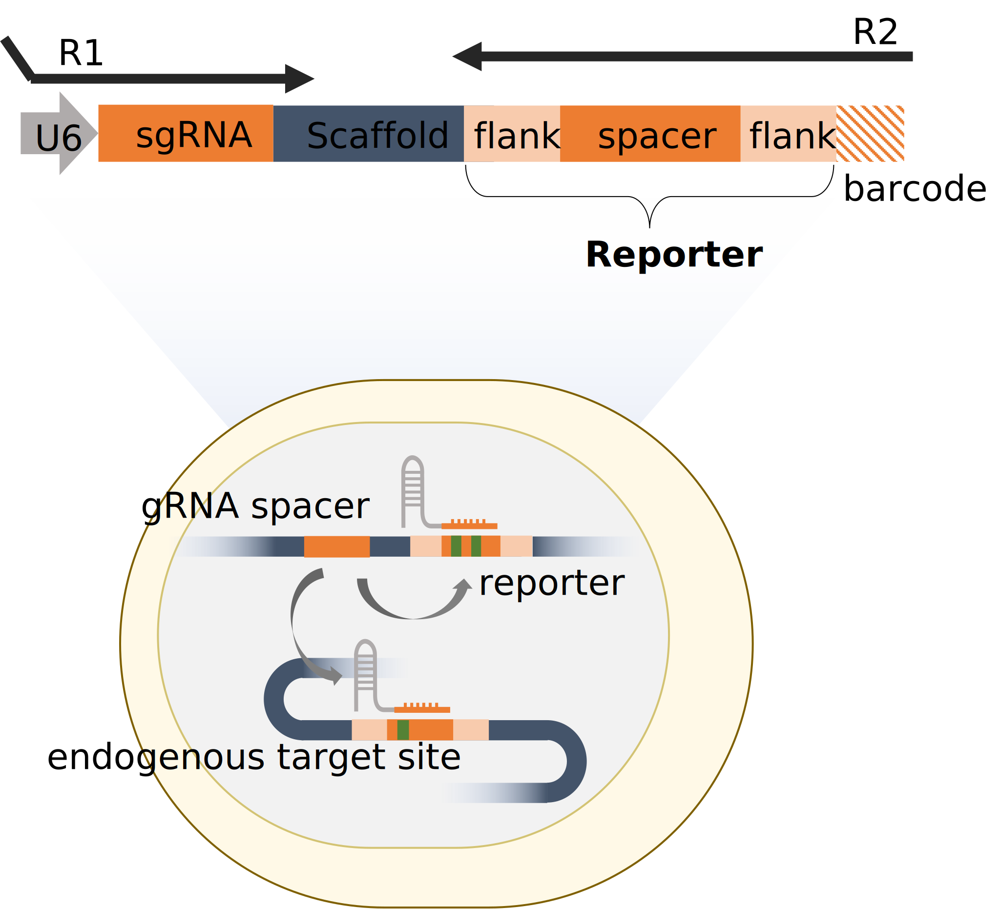
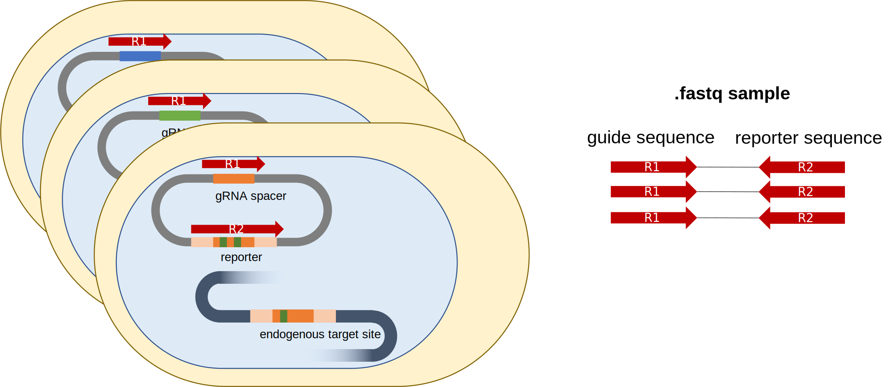

# 

[](https://pypi.org/project/berets/)
[](https://pypi.org/project/berets/)
[](https://github.com/psf/black)

**CRISPR** **B**ayesian **E**stimation of variant effect (from **B**ase **E**diting reporter screens) with guide **A**ctivity **N**ormalization  
This is an analysis toolkit for the pooled CRISPR reporter or sensor data. The reporter technique transfects cells with plasmid with not only sgRNA but with the **target sequence surrogate** which we call **reporter** or **sensor**.  




## Installation 
Downloading from PyPI:
```
pip install crispr-bean
```

## Count reporter screen data  
`beret-count-samples` or `beret-count` maps guide into guide counts, **allowing for base transition in spacer sequence**. When the matched reporter information is provided, it can count the **target site edits** and **alleles produced by each guide**. Mapping is efficiently done based on [CRISPResso2](https://github.com/pinellolab/CRISPResso2).


  

```python
beret-count-samples         \
  --input sample_list.csv   \ # sample with lines 'R1_filepath,R2_filepath,sample_name\n'  
  -b A                      \ # base that is being edited (A/G)
  -f gRNA_library.csv       \ # sgRNA information 
  -o .                      \ # output directory    
  -r                        \ # read edit/allele information from reporter  
  -t 12                     \ # number of threads  
  --name LDLvar_fullsort    \ # name of this sample run  
```
### Input file format
#### gRNA_library.csv
File should contain following columns.
* `name`: gRNA ID column
* `sequence`: gRNA sequence
* `barcode`: R2 barcode to help match reporter to gRNA  

Optional: 
* `strand`: Specifies gRNA strand information relative to reference genome. 
* `start_pos`: gRNA starting position in the genome. Required when you provide `strand` column. Should specify the smaller coordinate value among start and end position regardless of gRNA strandedness.
* `offset`: Specifies absolute positional offset to be added to edited position. Useful when you need amino acid translation results for ex. coding sequence tiling screens.
* `target_pos`: If `--match_target_pos` flag is used, input file needs `target_pos` which specifies 0-based relative position of targeted base within Reporter sequence.
  
### Output file format
`count` or `count-samples` produces `.h5ad` and `.xlsx` file with guide and per-guide allele counts.  
* `.h5ad`: This output file follows annotated matrix format compatible with `AnnData` and is based on `Screen` object in [purturb_tools](https://github.com/pinellolab/perturb-tools). The object contains the per-guide allele counts.
  * `.guides`: guide information provided in input (`gRNA_library.csv` in above example)
  * `.condit`: sample information provided in input (`sample_list.csv` in above example)
  * `.X`: Main guide count matrix, where row corresponds to each guide in `.guides` and columns correspond to samples in `.condit`.
Following attributes are included if matched reporter is provided and you chose to read edit/allele information from the reporter using `-r` option.
  * `.X_bcmatch` (Optional): Contains information about number of barcode-matched reads. Information about R2 barcode should be specified as `barcode` column in your `gRNA_library.csv` file.
  * `.X_edits` (Optional): If target position of each guide is specified as `target_pos` in input `gRNA_library.csv` file and `--match-target-position` option is provided, the result has the matrix with the number of target edit at the specified positions.
  * `.allele_tables` (Optional): Dictionary with a single allele count table that counts per guide and allele combination, what is the count per sample. 
* `.xlsx`: This output file contains `.guides`, `.condit`, `.X[_bcmatch,_edits]`. (`allele_tables` are often too large to write into an Excel!)


## Using as python module
```
import beret as br
cdata = br.read_h5ad("beret_counts_sample.h5ad")
```

See the [**tutorial**](docs/beret_test.ipynb) for more detail.
