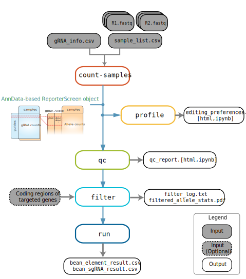
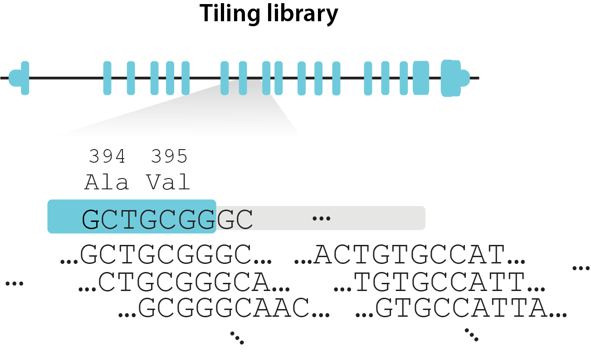

# 

[](https://pypi.org/project/crispr-bean/)
[](https://pypi.org/project/crispr-bean/)
[](https://github.com/psf/black)

`bean` (**B**ase **E**diting reporter screens with guide **A**ctivity **N**ormalization) is an analysis toolkit for the pooled CRISPR reporter or sensor data. The reporter technique transfects cells with plasmid with not only sgRNA but with the **target sequence surrogate** which we call **reporter** or **sensor**.  


## Overview
`bean` supports end-to-end analysis of pooled sorting screens, with or without reporter.  

  

`bean` subcommands include the following:
1. [`count`](https://pinellolab.github.io/crispr-bean/count.html), [`count-samples`](https://pinellolab.github.io/crispr-bean/count_samples.html): Base-editing-aware **mapping** of guide, optionally with reporter from `.fastq` files.
    *   [`create-screen`](https://pinellolab.github.io/crispr-bean/create_screen.html) creates minimal ReporterScreen object from flat gRNA count file. Note that this way, allele counts are not included and many functionalities involving allele and edit counts are not supported.
2. [`profile`](https://pinellolab.github.io/crispr-bean/profile.html): Profile editing preferences of your editor.  
3. [`qc`](#bean-qc-qc-of-reporter-screen-data): Quality control report and filtering out / masking of aberrant sample and guides  
4. [`filter`](#bean-filter-filtering-and-optionally-translating-alleles): Filter reporter alleles; essential for `tiling` mode that allows for all alleles generated from gRNA.
5. [`run`](#bean-run-quantify-variant-effects): Quantify targeted variants' effect sizes from screen data.  
* Screen data is saved as *ReporterScreen* object in the pipeline.
BEAN stores mapped gRNA and allele counts in `ReporterScreen` object which is compatible with [AnnData](https://anndata.readthedocs.io/en/latest/index.html). See [Data Structure](#data-structure) section for more information.
## Installation 
First install [PyTorch](https://pytorch.org/get-started/).
Then download from PyPI:
```
pip install crispr-bean[model]
```

Following installation without PyTorch dependency wouldn't have variant effect size quantification (`bean run`) functionality. 
```
pip install crispr-bean
```


## Documentaton
See the [documentation](https://pinellolab.github.io/crispr-bean/) for tutorials and API references.

## Tutorials
| [Library design](#pipeline-run-options-by-library-design) | Selection | Reporter |  Tutorial link |
|---------------| -------------- | --------- | -------- |
| GWAS variant library | FACS sorting | Yes/No | [GWAS variant screen](docs/tutorials/ldl_var.md) 
| Coding sequence tiling libarary | FACS sorting | Yes/No | [Coding sequence tiling screen](docs/tutorials/ldl_cds.md) 
| GWAS variant library | Survival / Proliferation | Yes/No |  TKO simulated (Coming soon!) 
| Coding sequence tiling libarary | Survival / Proliferation | Yes/No | TKO simulated, tiling (Coming soon!)  


### Library design: variant or tiling?
The `bean filter` and `bean run` steps depend on the type of gRNA library design, where BEAN supports two modes of running.
1. `variant` library: Several gRNAs tile each of the targeted variants  
  Ex)  
    

2. `tiling` library: gRNA densely tiles a long region (e.g. gene(s), exon(s), coding sequence(s))  
  Ex)  
    

## Data Structure
### ReporterScreen object
BEAN stores mapped gRNA and allele counts in `ReporterScreen` object which is compatible with [AnnData](https://anndata.readthedocs.io/en/latest/index.html).  


  * `.guides`: guide information provided in input (`gRNA_library.csv` in above example)
  * `.samples`: sample information provided in input (`sample_list.csv` in above example)
  * `.X`: Main guide count matrix, where row corresponds to each guide in `.guides` and columns correspond to samples in `.samples`.
Following attributes are included if matched reporter is provided and you chose to read edit/allele information from the reporter using `-r` option.
  * `.X_bcmatch [Optional]`: Contains information about number of barcode-matched reads. Information about R2 barcode should be specified as `barcode` column in your `gRNA_library.csv` file.
  * `.X_edits [Optional]`: If target position of each guide is specified as `target_pos` in input `gRNA_library.csv` file and `--match-target-position` option is provided, the result has the matrix with the number of target edit at the specified positions.
  * `.allele_tables [Optional]`: Dictionary with a single allele count table that counts per guide and allele combination, what is the count per sample. 

## Using BEAN as Python module
```
import bean as be
cdata = be.read_h5ad("bean_counts_sample.h5ad")
```
Python package `bean` supports multiple data wrangling functionalities for `ReporterScreen` objects. See the [**ReporterScreen API tutorial**](docs/ReporterScreen_api.ipynb) for more detail.

## Run time
* Installation takes 14.4 mins after pytorch installation with pytorch in Dell XPS 13 Ubuntu WSL.
* `bean run` takes 4.6 mins with `--scale-by-acc` tag in Dell XPS 13 Ubuntu WSL for variant screen dataset with 3455 guides and 6 replicates with 4 sorting bins.
* Full pipeline takes 90.1s in GitHub Action for toy dataset of 2 replicates and 30 guides.

## Contribution
If you have questions or feature request, please open an issue. Please feel free to send a pull request.

## Citation
If you have used BEAN for your analysis, please cite:  
Ryu, J. et al. Joint genotypic and phenotypic outcome modeling improves base editing variant effect quantification. medRxiv (2023) doi:10.1101/2023.09.08.23295253
