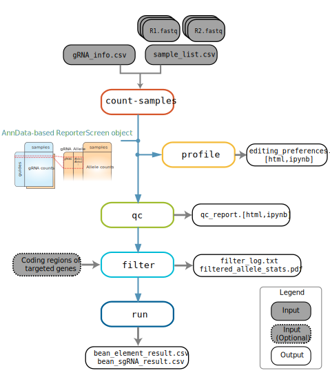
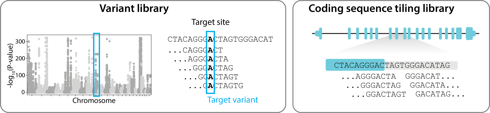

# 

[](https://pypi.org/project/crispr-bean/)
[](https://pypi.org/project/crispr-bean/)
[](https://github.com/pinellolab/crispr-bean/actions/workflows/CI.yml)
[](https://github.com/pinellolab/crispr-bean/actions/workflows/documentation.yml)
[](https://www.gnu.org/licenses/agpl-3.0)

`bean` improves CRISPR pooled screen analysis by 1) unconfounding variable per-guide editing outcome by considering genotypic outcome from *reporter* sequence and 2) through accurate modeling of screen procedure.


## Overview
`bean` supports end-to-end analysis of pooled sorting screens, with or without reporter.  

  

`bean` subcommands include the following: Click on the [`links`]() to see the full documentation.
1. [`count`](https://pinellolab.github.io/crispr-bean/count.html), [`count-samples`](https://pinellolab.github.io/crispr-bean/count_samples.html): Base-editing-aware **mapping** of guide, optionally with reporter from `.fastq` files.
    *   [`create-screen`](https://pinellolab.github.io/crispr-bean/create_screen.html) creates minimal ReporterScreen object from flat gRNA count file. Note that this way, allele counts are not included and many functionalities involving allele and edit counts are not supported.
2. [`profile`](https://pinellolab.github.io/crispr-bean/profile.html): Profile editing preferences of your editor.  
3. [`qc`](https://pinellolab.github.io/crispr-bean/qc.html): Quality control report and filtering out / masking of aberrant sample and guides  
4. [`filter`](https://pinellolab.github.io/crispr-bean/filter.html): Filter reporter alleles; essential for `tiling` mode that allows for all alleles generated from gRNA.
5. [`run`](https://pinellolab.github.io/crispr-bean/run.html): Quantify targeted variants' effect sizes from screen data.  
* Screen data is saved as [`ReporterScreen` object](https://pinellolab.github.io/crispr-bean/reporterscreen.html) in the pipeline.
BEAN stores mapped gRNA and allele counts in `ReporterScreen` object which is compatible with [AnnData](https://anndata.readthedocs.io/en/latest/index.html). 
## Installation 
First install [PyTorch](https://pytorch.org/get-started/).
Then download from PyPI:
```
pip install crispr-bean[model]
```

Following installation without PyTorch dependency wouldn't have variant effect size quantification (`bean run`) functionality. 
```
pip install crispr-bean
```


## Documentaton
See the [documentation](https://pinellolab.github.io/crispr-bean/) for tutorials and API references.

## Tutorials
| [Library design](#pipeline-run-options-by-library-design) | Selection | Reporter |  Tutorial link |
|---------------| -------------- | --------- | -------- |
| GWAS variant library | FACS sorting | Yes/No | [GWAS variant screen](https://pinellolab.github.io/crispr-bean/gwas) 
| Coding sequence tiling libarary | FACS sorting | Yes/No | [Coding sequence tiling screen](https://pinellolab.github.io/crispr-bean/cds) 
| GWAS variant library | Survival / Proliferation | Yes/No |  [GWAS variant screen](https://pinellolab.github.io/crispr-bean/prolif_gwas)
| Coding sequence tiling libarary | Survival / Proliferation | Yes/No | Coming soon!


### Library design: variant or tiling?
The `bean filter` and `bean run` steps depend on the type of gRNA library design, where BEAN supports two modes of running.
  

1. `variant` library: Several gRNAs tile each of the targeted variants. Only the editing rate of the target variant is considered and the bystander effects are ignored. 

2. `tiling` library: gRNA densely tiles a long region (e.g. gene(s), exon(s), coding sequence(s)). Bystander edits are considered to obtain alleles with significant fractions. Edited alleles can be "translated" to output coding variants.

## Using BEAN as Python module
```
import bean as be
cdata = be.read_h5ad("bean_counts_sample.h5ad")
```
Python package `bean` supports multiple data wrangling functionalities for `ReporterScreen` objects. See the [**ReporterScreen API tutorial**](docs/ReporterScreen_api.ipynb) for more detail.

## Run time
* Installation takes 14.4 mins after pytorch installation with pytorch in Dell XPS 13 Ubuntu WSL.
* `bean run` takes 4.6 mins with `--scale-by-acc` tag in Dell XPS 13 Ubuntu WSL for variant screen dataset with 3455 guides and 6 replicates with 4 sorting bins.
* Full pipeline takes 90.1s in GitHub Action for toy dataset of 2 replicates and 30 guides.

## Contributing
If you have questions or feature request, please open an issue. Please feel free to send a pull request.

## Citation
If you have used BEAN for your analysis, please cite:  
Ryu, J. et al. Joint genotypic and phenotypic outcome modeling improves base editing variant effect quantification. medRxiv (2023) doi:10.1101/2023.09.08.23295253
