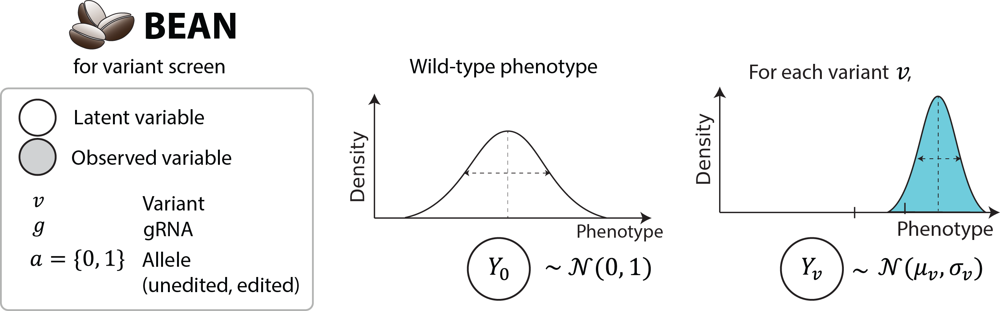
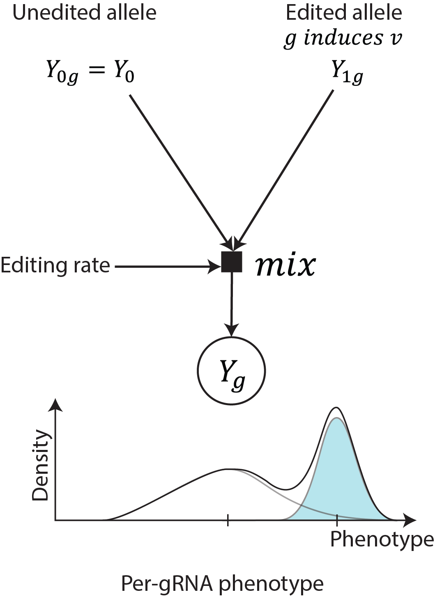
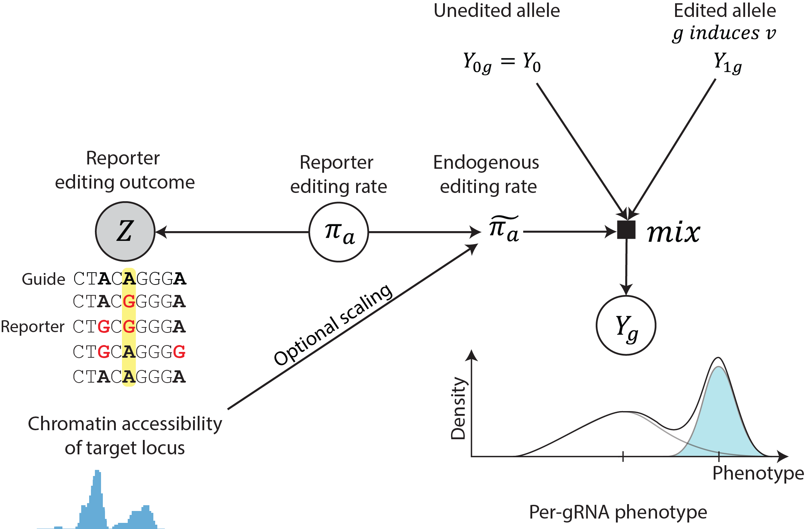
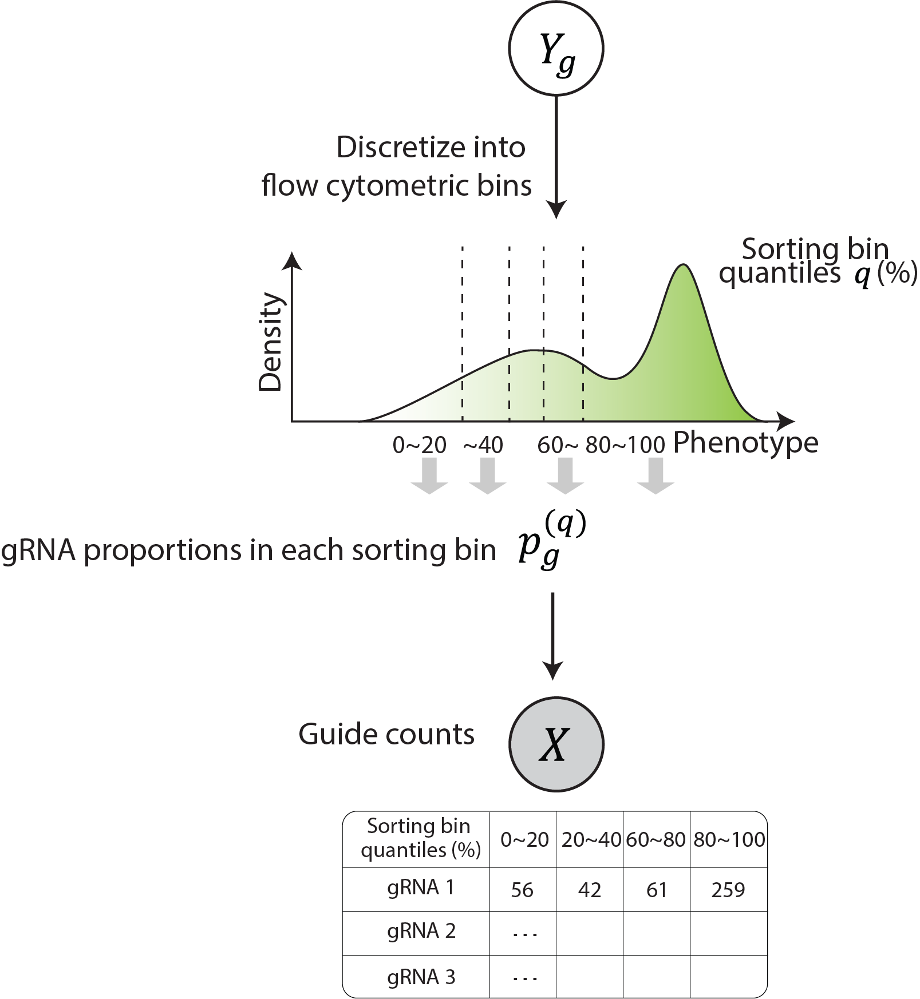
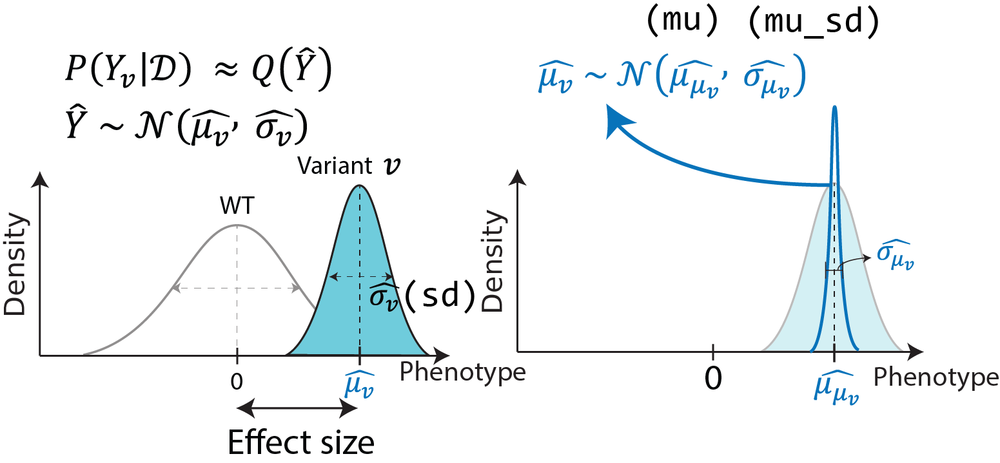
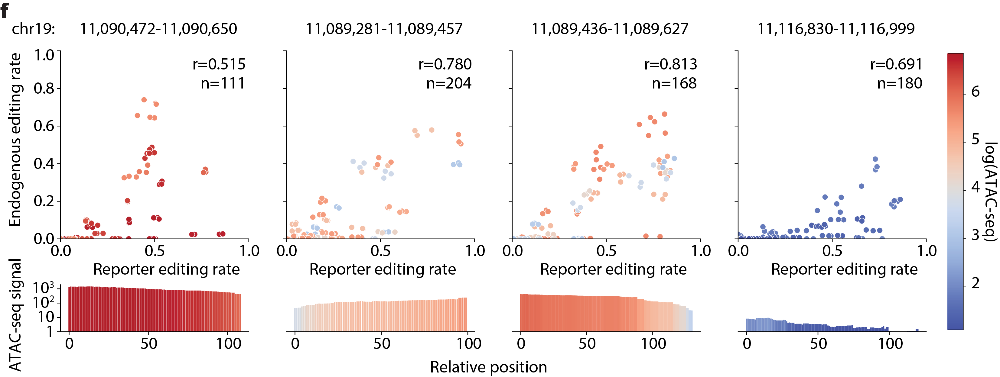

# BEAN model description

## Variant and guide-level phenotypes

BEAN models the **phenotype of cells** with variant $v,$ $Y_{v}$ ,**as normal distribution**, where the **wild-type cells have standard normal phenotypic distribution** $Y_{0}$ and the variant effects are quantified in a
relative scale, using $Y_{0}$ as reference.  

<figure>

</figure>

For the cells with a guide, their phenotype is modeled as a mixture of allelic distributions
produced by the guide, reflecting the heterogeneous outcome from a guide.  

### `variant` mode

In `variant` mode for variant screens (e.g., GWAS candidate variant targeting library), we aggregate alleles into two
categories: alleles with ($Y_{g1}$) or without ($Y_{g0}$) the target variant. The non-edited component in these models is fixed to have a wild-type phenotypic distribution $Y_0$. That is, the phenotype $Y_{g}$ of cells with gRNA $g$ that induces variant $v$ with editing rate $\pi$ is
modeled as follows:

$$f_{Y_{g}}(y) = \left( 1 - \pi_{g} \right)f_{Y_{0}}(y) + \pi_{g}f_{Y_{v}}(y)$$

$$Y_{0}\mathcal{\sim\ N}\left( 0,\ 1 \right)$$

$$\mu_{v}\sim Laplace(0,\ 1)$$

$$\sigma_{v}\sim LogNormal(0,\ 0.01)$$

$$Y_{v}\mathcal{\sim N(}\mu_{v},\ \sigma_{v})$$

$$\mu_{v}\sim Laplace(0,\ 1)$$

$$\sigma_{v}\sim LogNormal(0,\ 0.01)$$

, where $f_{Y_g}$ indicates the probability density function of $Y$. The prior for $\mu_{v}$ and $\sigma_{v}$ are set to be narrow based on the assumption that most variant would have close to wild-type effect size
of mean 0 and standard deviation 1.

<figure>

</figure>

### Multiallelic outcome modeling in `tiling` mode

For saturation tiling screen, as bystander edits are more likely to have phenotypic effect, BEAN accounts for **more than one non-wild-type allele** where each allele may include one or more variants. Here, we use the term "allele" to refer to the multiple editing outcome produced by base editing, and we can aggregate multiple nucleotide-level variants that lead to the same coding sequence amino acid mutations together (if you use `--translate` flag in `bean filter`). 

We denote with
$A\left( g \right) = \{ a|Allele\ a\ is\ produced\ by\ g\}$ the set of alleles produced by gRNA $g$ that is robustly observed (defined by thresholds in `bean-filter`) The phenotype of a given allele $a$ is defined as the **sum of phenotypic effect of variants consisting the allele**. Finally, the phenotype of cells with gRNA $g$ is modeled
again as the mixture distribution of allelic phenotype for the alleles
it induces ($a \in A(g)$) as follows:

$$f_{Y_{g}}(y) = \ \sum_{a \in A(g)}^{}{{\widetilde{\pi}}_{a}f_{Y_{a}}(y)}$$

$$Y_{a} = \ \sum_{v \in a}^{}Y_{v},\ \ Y_{a} = Y_{0}\text{\ if\ }\left| a \right| = 0$$

, where $\widetilde{\pi_{a}}$ is the endogenous editing rate, estimated
from $\pi_{a}$, the reporter editing rate, of allele $a$. The non-edited
allele phenotype and the priors for $\mu_{v}$ and $\sigma_{v}$ are
identical to the variant screen modeling.

## Learning editing rate from reporter
Allele editing rates are learned from per-gRNA reporter allele counts in pre-sort (bulk) sample (fed in as `--control-condition` in `bean run`). 
$\mathbf{\pi}_{\mathbf{g}} = (\pi_{g0},\ \ldots,\ \pi_{g|A\left( g \right)|})$
and per-gRNA allele count
$\mathbf{Z}_{\mathbf{g}} = \left( A_{g0},\ \ldots,\ A_{g\left| A\left( g \right) \right|} \right)$
are modeled as the Dirichlet and Multinomial distributions :

$$\widetilde{\mathbf{\alpha}_{\mathbf{\text{gπ}}}} = \frac{\mathbf{\alpha}_{\mathbf{\text{gπ}}} + \epsilon}{\sum\mathbf{\alpha}_{\mathbf{\text{gπ}}} + \epsilon}\alpha_{\text{gπ}}^{\circ}$$

$$\mathbf{\pi}_{\mathbf{g}}\mathbf{\ }\sim\ Dir(\widetilde{\mathbf{\alpha}_{\mathbf{\text{gπ}}}})$$

$$\mathbf{Z}_{\mathbf{g}}\ \sim\ Multinomial(\mathbf{\pi}_{\mathbf{g}})$$

Where $\mathbf{\alpha}_{\mathbf{\pi}}$ is initialized as
$\overrightarrow{\mathbf{1}}$, $\epsilon = 1e^{- 5}$ and
$\alpha_{\text{gπ}}^{\circ}$ is the precision parameter that is fitted
from the data (see [Over-dispersed multinomial count data modeling](#over-dispersed-multinomial-count-data-modeling)). This approach partially follows DESeq2 approach of dispersion parameter estimation for the Negative Binomial distribution. 

Optionally, the reporter editing rate $\mathbf{\pi}_{\mathbf{g}}$ can further scaled by accessibility to be
used as the endogenous editing rate $\widetilde{\mathbf{\pi}_{\mathbf{g}}}$ through a function $f$, by feeding in (`--scale-by-acc` flag into `bean run`). This function $f$ is learned a priori from the paired reporter and endogenous
editing rate data while the deviation of $\widetilde{\mathbf{\pi}_{\mathbf{g}}}$ from $f\left( \mathbf{\pi}_{\mathbf{g}} \right)$ is fitted per gRNA. The deviation $\epsilon_{\text{πg}}$ below accounts for the incomplete correlation between endogenous and reporter editing rates.

$$\widetilde{\pi_{\text{gj}}} = \frac{f(\pi_{\text{gj}})}{\sum_{j \in \left\{ 1,\ ..,\ \left| A\left( g \right) \right| \right\}}^{}{f(\pi_{\text{gj}})}} + \ \epsilon_{\pi},\ \ f\left( \pi \right) = \pi e^{b}w^{a}$$

$$\epsilon_{\text{gπ}} = logit^{- 1}\left( l_{\text{gπ}} \right),\ \ l_{\text{gπ}}\mathcal{\ \sim\ N}(0,\ \sigma_{\pi})$$

$$\widetilde{\mathbf{\pi}_{\mathbf{g}}} = \left( 1 - \sum_{j \in \left\{ 1,..\ ,\ \left| A\left( g \right) \right| \right\}}^{}\widetilde{\pi_{\text{gj}}},\ \ \widetilde{\pi_{g1}},\ \ \ldots,\ \ \widetilde{\ \pi_{\text{gn}}} \right)$$

<figure>

</figure>

$f\left( \pi \right)$ is fitted from the data generated for comparison of endogenous and reporter editing based on the regression $E\left\lbrack \log\left( \frac{\pi_{\text{endo}}}{\pi_{\text{reporter}}} \right) \right\rbrack = aw + b$ where $w$ is $log(accessibility\ signal + 1)$ and the resulting coefficients $a = 0.2513$ and $b = \  - 1.9458$ are used for the analyses presented in this paper. The residual of the regression is fitted as the Normal distribution, which is used as the prior for the
logit-scale deviation $l_{\pi}$ (see full detail in [Accessibility scaling](#adjusting-editing-rates-by-accessibility-with---scale-by-acc) section).

### `bean run` without reporter
When `bean run` is fed with `--uniform-edit`, it does not require the data to have reporter counts. In this scenario, the model assumes a single component Normal distribution of cellular phenotype, reflecting the assumption that all gRNAs would have the same editing efficiency.

$$Y_{g}\mathcal{\sim\ N}\left( \mu_{v},\ \sigma_{v} \right),\ g\ induces\ v$$

## Sorting screen model (`bean run ... sorting`)

Sorting screens sorts the pool of cells with different gRNA and editing
outcomes into distinct bins based on the phenotype they're sorted on
prior to sequencing. To model the sorting procedure, the proportion of
cells that falls within sorting quantile bins for each gRNA is
calculated analytically. This process allows for the determination of
the relative fraction of cells with the gRNA that falls into each
sorting bin, which is then used as the concentration parameter of
Dirichlet-Multinomial distribution. Dirichlet-Multinomial distribution
is chosen to model the gRNA read count across sorting bins that is
over-dispersed multinomial count distribution, which we confirm from our
data (see more on **Supplementary Note 4** of the manuscript).  

The gRNA read counts across sorting bins
$$\mathbf{X}_{\mathbf{\text{gr}}} = (X_{\text{gr}}^{\left( 0.0,\ 0.2 \right)},\ X_{\text{gr}}^{\left( 0.2,\ 0.4 \right)},\ X_{\text{gr}}^{\left( 0.6,\ 0.8 \right)},\ X_{\text{gr}}^{\left( 0.8,\ 1.0 \right)})$$
and the barcode-matched gRNA read count
$\mathbf{X}_{\mathbf{\text{gr}}}^{\mathbf{b}}\mathbf{\ }$for gRNA $g$
and replicate $r$ are modeled as following:

$$p_{g}^{(q_{l},\ q_{h})} = P\left( q_{l} \leq Y_{g} \leq q_{h} \right) = \ \sum_{a}^{}{\Phi\left( \frac{q_{h} - \mu_{a}}{\sigma_{a}} \right) - \Phi\left( \frac{q_{l} - \mu_{a}}{\sigma_{a}} \right)}$$

$$\mathbf{p}_{\mathbf{g}} = (p_{g}^{\left( 0.0,\ 0.2 \right)},\ p_{g}^{\left( 0.2,\ 0.4 \right)},\ p_{g}^{\left( 0.6,\ 0.8 \right)},\ p_{g}^{\left( 0.8,\ 1.0 \right)})$$

$$\widetilde{\mathbf{p}_{\mathbf{g}}} = \ \frac{\mathbf{p}_{\mathbf{g}}}{\sum\mathbf{p}_{\mathbf{g}}}p_{g}^{\circ}$$

$$\mathbf{X}_{\mathbf{\text{gr}}}\ \sim\ DirichletMultinomial(\widetilde{\mathbf{p}_{\mathbf{g}}} \odot \mathbf{s}_{\mathbf{r}})$$

$$\mathbf{X}_{\mathbf{\text{gr}}}^{\mathbf{b}}\ \sim\ DirichletMultinomial(\widetilde{\mathbf{p}_{\mathbf{g}}^{\mathbf{b}}} \odot \mathbf{s}_{\mathbf{r}}^{\mathbf{b}})$$

,where $\odot$ denotes element-wise multiplication. Here,
$\mathbf{p}_{\mathbf{g}}$ is scaled as $\mathbf{\alpha}_{\mathbf{\pi}}$
by the data-fitted precision parameter $p_{g}^{\circ}$ ([Over-dispersed multinomial count data modeling](#over-dispersed-multinomial-count-data-modeling)) then scaled by the sample-specific size factor $s_r$
$$\mathbf{s}_{\mathbf{r}}\mathbf{=}(s_{r}^{\left( 0.0,\ 0.2 \right)},\ s_{r}^{\left( 0.2,\ 0.4 \right)},\ s_{r}^{\left( 0.6,\ 0.8 \right)},\ s_{r}^{\left( 0.8,\ 1.0 \right)})\ \mathbf{\ }$$
where the sample size factor is calculated as in DESeq2. 

<figure>

</figure>

For sample
$j$,
$s_{j} = \text{median}_{g}\left(\frac{X_{\text{gj}}}{\left( \prod_{v = 1}^{m}X_{\text{gj}} \right)^{1/m}} \right)$and
the same function is used to calculate size factor for barcode-matched
read counts for sample $j$, $s_{j}^{b}$ with $X_{\text{gj}}^{b}$. 

## Inference
The parameters $\mu_{v},\ \sigma_{v},\ \alpha_{\pi},\ l_{\pi}$ of
posterior distributions are fitted using stochastic variational
inference (SVI) using Pyro. Specifically, the posterior phenotypic distribution
of each variant is fitted as a Normal distribution with a posterior
standard deviation parameter and mean parameter which has Normal
posterior distribution:

$$P\left( Y_{v} \middle| \mathcal{D} \right)\  \approx Q(\widehat{Y})$$

$$\widehat{Y}\mathcal{\ \sim\ N(}\widehat{\mu_{v}},\ \widehat{\sigma_{v}})$$

$$\widehat{\mu_{v}}\mathcal{\ \sim\ N(}\widehat{\mu_{\mu_{v}}},\ \widehat{\sigma_{\mu_{v}}})$$

Where $\mathcal{D}$ is observed data for the model and $Q$ is the
variational distribution.  

<figure>

</figure>

Negative control variants are used to control
the significance of variant effect, by fitting the shared phenotypic
distribution of negative controls as a single normal distribution.
Subsequently the results are scaled so that the fitted negative control
distribution is transformed to a standard normal.

$$\widehat{Y_{\text{ctrl}}}\mathcal{\ \sim\ N(}\widehat{\mu_{\text{ctrl}}},\ \widehat{\sigma_{\text{ctrl}}})$$

$$Y_{v}^{\left( \text{scaled} \right)} = \frac{\widehat{Y_{v}} - \ \widehat{\mu_{\text{ctrl}}}}{\widehat{\sigma_{\text{ctrl}}}\text{|}\mathcal{D}}\mathcal{\ \ \sim\ N(}\mu_{v}^{\left( \text{scaled} \right)},\ \sigma_{v}^{\left( \text{scaled} \right)})$$

$$\mu_{v}^{\left( \text{scaled} \right)} = \frac{\widehat{\mu_{\mu_{v}}} - \widehat{\mu_{\text{ctrl}}}}{\widehat{\sigma_{\text{ctrl}}}}\mathcal{\ \ \sim\ N(}\mu_{\mu_{v}}^{\left( \text{scaled} \right)},\ \sigma_{\mu_{v}}^{\left( \text{scaled} \right)})$$

In order to control for false discovery with negative control variants,
the standard deviations of variants
$\sigma_{\mu_{v}}^{\left( \text{scaled} \right)}$ are scaled so that the
standard deviation of $\mu_{n}$, where $n$ are the negative control
variants, is equal to 1. 

$$\sigma_{\mu_{v}}^{(adj)} = \ \sigma_{\mu_{v}}^{\left( \text{scaled} \right)}\ *\widehat{\sigma_{n}}$$

Where $\widehat{\sigma_{n}}$ is fitted as the standard deviation
estimate of
$z_{\mu_{n}}^{(scaled)} = \mu_{\mu_{n}}^{\left( \text{scaled} \right)}/\sigma_{\mu_{n}}^{(scaled)}$.

The model\'s output includes various parameters relating to the
phenotype of the variant, such as the mean and standard deviation of
variant phenotype
$\mu_{v}^{\left( \text{scaled} \right)},\ \sigma_{v}^{\left( \text{scaled} \right)}$
and scaled and significance-adjusted phenotypic mean distribution
parameters
$\mu_{\mu_{v}}^{\left( \text{scaled} \right)},\ \sigma_{\mu_{v}}^{\left( \text{scaled} \right)},\ \sigma_{v}^{(adj)},\ z_{\mu_{v}}^{(adj)}$
where
$z_{\mu_{v}}^{(adj)} = \mu_{\mu_{v}}^{\left( \text{scaled} \right)}/\ \sigma_{\mu_{v}}^{(adj)}$
are reported together with metrics quantifying per-variant evidence
provided in the input. For \`variant\` mode, the mean targeting gRNA
editing rate is reported and for \`tiling\` mode, the number of gRNAs
covering each variant (\`n_guide\`), number of co-occurring variants
that is edited together in any of the observed alleles (\`n_coocc\`),
and effective editing rate which is calculated as
$\sum_{g \in \{ g|g\ induces\ v\}}^{}{\sum_{a \in \{ g\ induces\ a,\ a\ has\ v\}}^{}\frac{\widetilde{\pi_{\text{ga}}}}{\left| a \right|}}$,
are reported. The model, variational distribution and inference
procedure are available as the default options of `bean-run` command
of *bean*^21^ software. Specifically, BEAN-Uniform is run with
`--uniform-edit` and full BEAN model is run by specifying
`--scale-by-acc` argument.
## Adjusting editing rates by accessibility with `--scale-by-acc`

BEAN takes account for the observation that endogenous editing rate
 $\widetilde{\mathbf{\pi}}$ is roughly proportional to the reporter
editing rate $\mathbf{\pi}$ and is scaled by the loci accessibility. 
<figure>

<figcaption>Fig 1f of the manuscript</figcaption>
</figure>

In the model, BEAN fits a function $f$ that maps the reporter editing rate
to the endogenous editing rate by assuming the proportional relationship
with error
$\widetilde{\pi_{\text{gj}}} = f\left( \pi_{\text{gj}} \right) = c\pi_{\text{gj}} + \epsilon_{g}$
for non-wild-type allele $j$ and the scaling factor $c$ is the function
of accessibility.

The scaling factor $c$ is fitted from data by fitting the ratio between
the observed nucleotide-level editing rate $\pi_{\text{gi}}$ in reporter
and endogenous target site editing rate $\widetilde{\pi_{\text{gi}}}$ in
the mini-tiling screen data. Specifically, linear model of
$r = \log\left( \frac{\widetilde{\pi_{\text{gi}}} + 0.05}{\pi_{\text{gi}} + 0.05} \right),\ \ E\left\lbrack r \right\rbrack = aw + b$
was studied where
$w = \text{window\_mean}\left( \log\left( \text{accessibility\_signal} + 1 \right) \right)$
and $\text{accessibility\_signal}$ is the mean log-transformed accessibility signal.
The coefficients were fitted to be
$a = 0.2513,\ b = - 1.9458$ from our data and would be used as the default value.

The fitted relationship was used to transform allele editing rate in the
reporter to the rate in the endogenous editing. To account for the
deviation of $r$ from the predicted, $\epsilon_{g}$
=$\text{logit}\left( \sum_{i \neq 0}^{}\widetilde{\pi_{\text{gj}}} \right) - logit\left( \sum_{i \neq 0}^{}\pi_{\text{gj}} \right)$
is fitted during the inference time per gRNA $g$, and its prior is set
to be $\epsilon_{g}\mathcal{\sim N}(0,\ \sigma_{\epsilon})$ where
$\sigma_{\epsilon} = 0.655$ is the observed standard deviation of the
residual
$\text{logit}\left( \widetilde{\pi_{\text{gi}}} \right) - logit\left( f\left( \pi_{\text{gi}} \right) \right)$
using the $f$ from the above fitted relationship.

See full detail in Supplementary Notes 2.4.3 and Supplementary Figure 16 in the manuscript.

## Over-dispersed multinomial count data modeling

We follow the DESeq procedure of utilizing depth-normalized sample
mean and variance to fit the total concentration estimate
$\alpha_{g}^{\circ} = \sum_{k}^{}\alpha_{g}^{(k)}$ for each gRNA $g$ and
trend-fitting the concentration estimates with depth-normalized total
counts, where $\alpha_{g}^{(k)}$is the concentration parameter of
Dirichlet-Multinomial distribution
$X_{g}\ \sim\ DirMult(n_{g},\ \mathbf{\alpha =}(\alpha_{g}^{\left( 1 \right)},\ldots,\ \alpha_{g}^{(d)}))$
of a specific gRNA $g$. Subscript $g$ is omitted below until otherwise
described for simplicity.

First, we obtain formula to estimate per-gRNA $\alpha^{\circ}$ values
using method-of-moments. For
$X = (X^{\left( 1 \right)},\ldots,\ X^{(d)})$ and
$k \in \{ 1,\ \ldots,\ d\}$,

$$\mu^{(k)} = E\left\lbrack X^{(k)} \right\rbrack = np^{(k)}$$

$$V^{(k)} = Var\left( X^{(k)} \right) = np^{(k)}\ \left( 1 - p^{(k)} \right)\left( 1 + \frac{n - 1}{1 + \alpha^{\circ}} \right)\ $$

Where $p^{(k)} = \frac{\alpha^{\left( k \right)}}{\alpha^{\circ}}$.
Given $n$, we can get the method-of-moment estimates of $p^{(k)}$and
$\alpha^{\circ}$ as

$$\widehat{p^{(k)}} = \frac{\widehat{\mu^{(k)}}}{n}$$

$$\widehat{\alpha^{\circ}} = \left( \sum_{k \in \left\{ 1\ldots d \right\}}^{}{\frac{n - 1}{\frac{\widehat{V^{(k)}} - \widehat{\mu^{(k)}}}{n\widehat{p^{(k)}}\left( 1 - \widehat{p^{(k)}} \right)} - 1 + \frac{1}{1 - \widehat{p^{(k)}}}} - 1} \right)/d\ $$

Next, as multiple observations from different replicates does not share
$n$ across replicates, we follow DESeq's count normalization procedure
to obtain within-group variances and means as follows. Here,
$s_{r}^{\left( k \right)}$ is the size factor of the sample in
$r^{\text{th}}$ replicate and $k^{\text{th}}$ sorting bin calculated as in DESeq2.

$$\widehat{\mu^{(k)}} = \sum_{r = 1\ldots R}^{}\frac{X_{r}^{\left( k \right)}\text{/}\ s_{r}^{\left( k \right)}}{R}$$

$$\widehat{V^{(k)}} = \frac{\sum_{r = 1\ldots R}^{}\left( X_{r}^{\left( k \right)}\text{/}\ s_{r}^{\left( k \right)} - \widehat{\mu^{\left( k \right)}} \right)^{2}}{R}$$

We report overdispersion of counts from comparing within-group variances
and and multinomial variances.
Furthermore, we observed strong linear trend between the normalized
total count $\widehat{n} = \sum_{k}^{}\widehat{\mu^{(k)}}$ and
$\widehat{\alpha^{\circ}}$ in log
scale. Thus, the linear trend between $log(\widehat{n})$ and
$log(\widehat{\alpha^{\circ}})$ is fit (See more detail in Supplementary Fig. 17 of the manuscript).

$$\tau_{g} = \ \log\left( \widehat{\alpha_{g}^{\circ}} \right)\sim\beta_{0} + \beta_{1}log({\widehat{n}}_{g})$$

$$\log\left( {\widehat{\alpha^{\circ}}}_{\text{tr}}\left( {\widehat{n}}_{g} \right) \right) = \widehat{\beta_{0}} + \widehat{\beta_{1}}log({\widehat{n}}_{g})$$

We
take$\ {\widehat{\alpha^{\circ}}}_{\text{tr}}\left( {\widehat{n}}_{g} \right)$
as the final $\alpha^{\circ}$ estimate. We provide the option to shrink
the $\widehat{\alpha_{g}^{\circ}}$ for each gRNA $g$ towards the
trend-fitted
${\widehat{\alpha^{\circ}}}_{\text{tr}}\left( {\widehat{n}}_{g} \right)$
with `--shrink-alpha` argument of `bean run` that utilizes
Normal-Normal conjugacy. Specifically, we consider the trend-fitted
concentration estimate
$\log\left( {\widehat{\alpha^{\circ}}}_{\text{tr}}\left( {\widehat{n}}_{g} \right) \right)$
as the mean of the prior distribution of $\kappa_{g}$, which is the mean
of the normal distribution that gives rise to the
methods-of-moment(MoM)-fitted
$\tau_{g} = \log\left( \widehat{\alpha_{g}^{\circ}} \right)$ for
individual gRNA.

$$\kappa_{g}\mathcal{\sim\ N}\left( \log\left( {\widehat{\alpha^{\circ}}}_{\text{tr}}\left( {\widehat{n}}_{g} \right) \right),\ \eta \right)$$

$$\tau_{g}|\kappa_{g}\mathcal{\ \sim\ N}\left( \kappa_{g},\ \nu \right)\ $$

$$\eta = \frac{\sum_{g \in G}^{}\left( \tau_{g} - log\left( {\widehat{\alpha^{\circ}}}_{\text{tr}}\left( {\widehat{n}}_{g} \right) \right)\  \right)^{2}}{\left| G \right| - 1}$$

$${\log\left( \widehat{\alpha_{g}^{\circ}} \right)}_{\text{shrink}} = E\left\lbrack \kappa_{g} \middle| \tau_{g} \right\rbrack = \ \frac{\eta}{\nu + \eta}\tau_{g} + \frac{\nu}{\nu + \eta}\log\left( {\widehat{\alpha^{\circ}}}_{\text{tr}}\left( {\widehat{n}}_{g} \right) \right)$$

Here, $G$ is the set of gRNAs.
