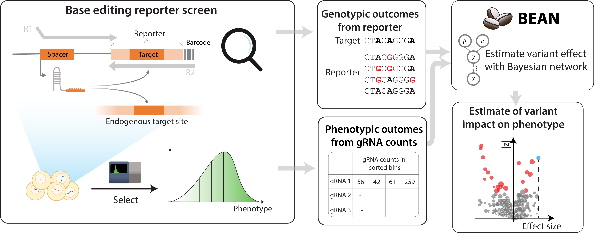

.. bean documentation master file, created by
   sphinx-quickstart on Fri Mar 29 19:10:46 2024.
   You can adapt this file completely to your liking, but it should at least
   contain the root `toctree` directive.

Welcome to `bean`'s documentation!
================================
`bean` unconfounds variant effect from variable editing outcome of CRISPR screens by considering genotypic outcome from *reporter* sequence. 

===================
Workflows
===================
.. toctree::
    :maxdepth: 1

    gwas
    cds
    prolif_gwas
    input

===================
API references
===================
.. toctree::
    :maxdepth: 3

    subcommands

===================
Screen data structure
===================
.. toctree::
    reporterscreen
    ReporterScreen_api

==================
Indices and tables
==================

* :ref:`genindex`
* :ref:`modindex`
* :ref:`search`
