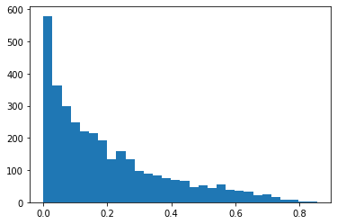

|Open In Colab|

.. |Open In Colab| image:: https://colab.research.google.com/assets/colab-badge.svg
   :target: https://colab.research.google.com/drive/1tsbLl_yB9lcC_lo4sjwEoI0r1KAjPkoB

CRISPR Reporter Screen analysis with BEAN
=========================================

In this tutorial, we will cover \* Obtaining target variant editing rate
from allele count information \* ReporterScreen object slicing
(indexing) \* Allele filtering based on significance

For the basic API of ReporterScreen object, see `perturb-tools tutorial
of Screen
API <https://github.com/pinellolab/perturb-tools/blob/main/perturb_tools/screen_demo.ipynb>`__.

.. code:: ipython3

    ! pip install -q crispr-bean

.. parsed-literal::

    Looking in indexes: https://pypi.org/simple, https://us-python.pkg.dev/colab-wheels/public/simple/
    Collecting beans==0.1.2
      Downloading beans-0.1.2.tar.gz (464 kB)
         |████████████████████████████████| 464 kB 4.1 MB/s 
    [?25h  Installing build dependencies ... [?25l[?25hdone
      Getting requirements to build wheel ... [?25l[?25hdone
        Preparing wheel metadata ... [?25l[?25hdone
    Requirement already satisfied: numpy in /usr/local/lib/python3.7/dist-packages (from beans==0.1.2) (1.21.6)
    Collecting perturb-tools>=0.0.16
      Downloading perturb-tools-0.1.4.tar.gz (147 kB)
         |████████████████████████████████| 147 kB 51.2 MB/s 
    [?25hCollecting matplotlib>=3.4
      Downloading matplotlib-3.5.3-cp37-cp37m-manylinux_2_5_x86_64.manylinux1_x86_64.whl (11.2 MB)
         |████████████████████████████████| 11.2 MB 51.2 MB/s 
    [?25hCollecting anndata>=0.7.1
      Downloading anndata-0.8.0-py3-none-any.whl (96 kB)
         |████████████████████████████████| 96 kB 4.9 MB/s 
    [?25hRequirement already satisfied: pandas>=1.1.2 in /usr/local/lib/python3.7/dist-packages (from perturb-tools>=0.0.16->beans==0.1.2) (1.3.5)
    Collecting biopython>=1.79
      Downloading biopython-1.79-cp37-cp37m-manylinux_2_5_x86_64.manylinux1_x86_64.whl (2.3 MB)
         |████████████████████████████████| 2.3 MB 57.1 MB/s 
    [?25hCollecting pool-sharq>=0.0.12
      Downloading pool_sharq-0.0.12-py3-none-any.whl (7.8 kB)
    Requirement already satisfied: plotly in /usr/local/lib/python3.7/dist-packages (from perturb-tools>=0.0.16->beans==0.1.2) (5.5.0)
    Requirement already satisfied: regex in /usr/local/lib/python3.7/dist-packages (from perturb-tools>=0.0.16->beans==0.1.2) (2022.6.2)
    Requirement already satisfied: typing_extensions in /usr/local/lib/python3.7/dist-packages (from anndata>=0.7.1->perturb-tools>=0.0.16->beans==0.1.2) (4.1.1)
    Requirement already satisfied: importlib_metadata>=0.7 in /usr/local/lib/python3.7/dist-packages (from anndata>=0.7.1->perturb-tools>=0.0.16->beans==0.1.2) (4.12.0)
    Requirement already satisfied: packaging>=20 in /usr/local/lib/python3.7/dist-packages (from anndata>=0.7.1->perturb-tools>=0.0.16->beans==0.1.2) (21.3)
    Requirement already satisfied: scipy>1.4 in /usr/local/lib/python3.7/dist-packages (from anndata>=0.7.1->perturb-tools>=0.0.16->beans==0.1.2) (1.7.3)
    Requirement already satisfied: natsort in /usr/local/lib/python3.7/dist-packages (from anndata>=0.7.1->perturb-tools>=0.0.16->beans==0.1.2) (5.5.0)
    Requirement already satisfied: h5py>=3 in /usr/local/lib/python3.7/dist-packages (from anndata>=0.7.1->perturb-tools>=0.0.16->beans==0.1.2) (3.1.0)
    Requirement already satisfied: cached-property in /usr/local/lib/python3.7/dist-packages (from h5py>=3->anndata>=0.7.1->perturb-tools>=0.0.16->beans==0.1.2) (1.5.2)
    Requirement already satisfied: zipp>=0.5 in /usr/local/lib/python3.7/dist-packages (from importlib_metadata>=0.7->anndata>=0.7.1->perturb-tools>=0.0.16->beans==0.1.2) (3.8.1)
    Collecting fonttools>=4.22.0
      Downloading fonttools-4.37.3-py3-none-any.whl (959 kB)
         |████████████████████████████████| 959 kB 44.2 MB/s 
    [?25hRequirement already satisfied: pyparsing>=2.2.1 in /usr/local/lib/python3.7/dist-packages (from matplotlib>=3.4->perturb-tools>=0.0.16->beans==0.1.2) (3.0.9)
    Requirement already satisfied: kiwisolver>=1.0.1 in /usr/local/lib/python3.7/dist-packages (from matplotlib>=3.4->perturb-tools>=0.0.16->beans==0.1.2) (1.4.4)
    Requirement already satisfied: cycler>=0.10 in /usr/local/lib/python3.7/dist-packages (from matplotlib>=3.4->perturb-tools>=0.0.16->beans==0.1.2) (0.11.0)
    Requirement already satisfied: pillow>=6.2.0 in /usr/local/lib/python3.7/dist-packages (from matplotlib>=3.4->perturb-tools>=0.0.16->beans==0.1.2) (7.1.2)
    Requirement already satisfied: python-dateutil>=2.7 in /usr/local/lib/python3.7/dist-packages (from matplotlib>=3.4->perturb-tools>=0.0.16->beans==0.1.2) (2.8.2)
    Requirement already satisfied: pytz>=2017.3 in /usr/local/lib/python3.7/dist-packages (from pandas>=1.1.2->perturb-tools>=0.0.16->beans==0.1.2) (2022.2.1)
    Collecting licorice>=0.0.2
      Downloading licorice-0.0.3-py3-none-any.whl (8.1 kB)
    Collecting requests>=2.26.0
      Downloading requests-2.28.1-py3-none-any.whl (62 kB)
         |████████████████████████████████| 62 kB 1.4 MB/s 
    [?25hRequirement already satisfied: tqdm>=4.62.3 in /usr/local/lib/python3.7/dist-packages (from pool-sharq>=0.0.12->perturb-tools>=0.0.16->beans==0.1.2) (4.64.1)
    Collecting pyrequisites>=0.0.2
      Downloading pyrequisites-0.0.2-py3-none-any.whl (4.1 kB)
    Collecting beautifulsoup4>=4.10.0
      Downloading beautifulsoup4-4.11.1-py3-none-any.whl (128 kB)
         |████████████████████████████████| 128 kB 66.4 MB/s 
    [?25hCollecting soupsieve>1.2
      Downloading soupsieve-2.3.2.post1-py3-none-any.whl (37 kB)
    Requirement already satisfied: six>=1.5 in /usr/local/lib/python3.7/dist-packages (from python-dateutil>=2.7->matplotlib>=3.4->perturb-tools>=0.0.16->beans==0.1.2) (1.15.0)
    Requirement already satisfied: idna<4,>=2.5 in /usr/local/lib/python3.7/dist-packages (from requests>=2.26.0->pool-sharq>=0.0.12->perturb-tools>=0.0.16->beans==0.1.2) (2.10)
    Requirement already satisfied: urllib3<1.27,>=1.21.1 in /usr/local/lib/python3.7/dist-packages (from requests>=2.26.0->pool-sharq>=0.0.12->perturb-tools>=0.0.16->beans==0.1.2) (1.24.3)
    Requirement already satisfied: certifi>=2017.4.17 in /usr/local/lib/python3.7/dist-packages (from requests>=2.26.0->pool-sharq>=0.0.12->perturb-tools>=0.0.16->beans==0.1.2) (2022.6.15)
    Requirement already satisfied: charset-normalizer<3,>=2 in /usr/local/lib/python3.7/dist-packages (from requests>=2.26.0->pool-sharq>=0.0.12->perturb-tools>=0.0.16->beans==0.1.2) (2.1.1)
    Requirement already satisfied: tenacity>=6.2.0 in /usr/local/lib/python3.7/dist-packages (from plotly->perturb-tools>=0.0.16->beans==0.1.2) (8.0.1)
    Building wheels for collected packages: beans, perturb-tools
      Building wheel for beans (PEP 517) ... [?25l[?25hdone
      Created wheel for beans: filename=beans-0.1.2-cp37-cp37m-linux_x86_64.whl size=506725 sha256=43eb6b2b41a112f7ea2d37a17e1e9bd91dffd4599710f3958769f84e59b3e6b8
      Stored in directory: /root/.cache/pip/wheels/68/81/58/49b78bc024e2a5312dc830797a25c15c7acda4225b5b25d232
      Building wheel for perturb-tools (setup.py) ... [?25l[?25hdone
      Created wheel for perturb-tools: filename=perturb_tools-0.1.4-py3-none-any.whl size=54209 sha256=e383c22165c92cf7c22605aec1da8689f60d55d1c1ea530a925aa89e5ee6608d
      Stored in directory: /root/.cache/pip/wheels/35/75/47/47a3d25b1958a24d7d3ee488b8956a9f43bda0bb0761b4d67c
    Successfully built beans perturb-tools
    Installing collected packages: soupsieve, licorice, requests, pyrequisites, fonttools, beautifulsoup4, pool-sharq, matplotlib, biopython, anndata, perturb-tools, beans
      Attempting uninstall: requests
        Found existing installation: requests 2.23.0
        Uninstalling requests-2.23.0:
          Successfully uninstalled requests-2.23.0
      Attempting uninstall: beautifulsoup4
        Found existing installation: beautifulsoup4 4.6.3
        Uninstalling beautifulsoup4-4.6.3:
          Successfully uninstalled beautifulsoup4-4.6.3
      Attempting uninstall: matplotlib
        Found existing installation: matplotlib 3.2.2
        Uninstalling matplotlib-3.2.2:
          Successfully uninstalled matplotlib-3.2.2
    Successfully installed anndata-0.8.0 beautifulsoup4-4.11.1 beans-0.1.2 biopython-1.79 fonttools-4.37.3 licorice-0.0.3 matplotlib-3.5.3 perturb-tools-0.1.4 pool-sharq-0.0.12 pyrequisites-0.0.2 requests-2.28.1 soupsieve-2.3.2.post1

.. code:: ipython3

    import numpy as np
    import pandas as pd
    import seaborn as sns
    import matplotlib.pyplot as plt
    import bean as be

.. code:: ipython3

    !gdown 18Azb8YmmMvFZo9urc2TxZr540xXWOv_v

.. parsed-literal::

    Downloading...
    From: https://drive.google.com/uc?id=18Azb8YmmMvFZo9urc2TxZr540xXWOv_v
    To: /content/bean_count_072121_ABE_topbot_LDLvar.h5ad
    100% 40.2M/40.2M [00:00<00:00, 160MB/s]

.. code:: ipython3

    bdata = be.read_h5ad("bean_count_072121_ABE_topbot_LDLvar.h5ad")

Data Structure
--------------

ReporterScreen object is a shallow wrapper around
`AnnData <https://anndata.readthedocs.io/en/latest/>`__. More
comprehensive data wrangling documentation can be found in their
documentation.

.. code:: ipython3

    bdata

-  ``ReporterScreen.X``: guide count
-  ``ReporterScreen.guides``: guide metadata. Reference to
   ``AnnData.obs``
-  ``ReporterScreen.samples``: sample/condition metadata. Reference to
   ``AnnData.var``.
-  ``ReporterScreen.layers["X_bcmatch"]``: barcode-matched guide counts
-  ``ReporterScreen.layers["edits"]``: edit counts
-  ``ReporterScreen.uns["allele_counts"]``: allele counts per guide and
   condition
-  ``ReporterScreen.uns["edit_counts"]``: edit counts per guide and
   condition

``.guides`` attribute contains the information about each guide.

.. code:: ipython3

    bdata.guides

``.samples`` attribute contains the sample and condition specific
information.

.. code:: ipython3

    bdata.samples

Per-guide allele count information is stored in
``.uns['allele_counts']``.

.. code:: ipython3

    bdata.uns["allele_counts"]

.. raw:: html

    
      

        

          

    
    <table border="1" class="dataframe">
      <thead>
        <tr style="text-align: right;">
          <th></th>
          <th>guide</th>
          <th>allele</th>
          <th>rep1_bot</th>
          <th>rep2_bot</th>
          <th>rep3_VPA_bot</th>
          <th>rep4_VPA_bot</th>
          <th>rep1_bulk</th>
          <th>rep2_bulk</th>
          <th>rep3_VPA_bulk</th>
          <th>rep4_VPA_bulk</th>
          <th>rep1_top</th>
          <th>rep2_top</th>
          <th>rep3_VPA_top</th>
          <th>rep4_VPA_top</th>
        </tr>
      </thead>
      <tbody>
        <tr>
          <th>0</th>
          <td>LDLR_SA_3_g5</td>
          <td></td>
          <td>26</td>
          <td>13</td>
          <td>9</td>
          <td>13</td>
          <td>60</td>
          <td>21</td>
          <td>27</td>
          <td>31</td>
          <td>32</td>
          <td>26</td>
          <td>43</td>
          <td>43</td>
        </tr>
        <tr>
          <th>1</th>
          <td>LDLR_SA_3_g5</td>
          <td>0:13:+:A&gt;G</td>
          <td>6</td>
          <td>16</td>
          <td>11</td>
          <td>24</td>
          <td>29</td>
          <td>21</td>
          <td>28</td>
          <td>22</td>
          <td>27</td>
          <td>11</td>
          <td>20</td>
          <td>13</td>
        </tr>
        <tr>
          <th>2</th>
          <td>LDLR_SA_3_g5</td>
          <td>-12:1:+:A&gt;G,0:13:+:A&gt;G</td>
          <td>2</td>
          <td>16</td>
          <td>1</td>
          <td>24</td>
          <td>16</td>
          <td>5</td>
          <td>9</td>
          <td>4</td>
          <td>17</td>
          <td>12</td>
          <td>7</td>
          <td>3</td>
        </tr>
        <tr>
          <th>3</th>
          <td>LDLR_SA_3_g5</td>
          <td>0:13:+:A&gt;G,7:20:+:A&gt;G</td>
          <td>2</td>
          <td>0</td>
          <td>0</td>
          <td>0</td>
          <td>0</td>
          <td>0</td>
          <td>0</td>
          <td>9</td>
          <td>0</td>
          <td>0</td>
          <td>0</td>
          <td>0</td>
        </tr>
        <tr>
          <th>4</th>
          <td>LDLR_SA_3_g5</td>
          <td>-12:1:+:A&gt;G,-8:5:+:A&gt;G,0:13:+:A&gt;G,10:23:+:A&gt;G</td>
          <td>1</td>
          <td>0</td>
          <td>0</td>
          <td>0</td>
          <td>0</td>
          <td>0</td>
          <td>0</td>
          <td>0</td>
          <td>0</td>
          <td>0</td>
          <td>0</td>
          <td>0</td>
        </tr>
        <tr>
          <th>...</th>
          <td>...</td>
          <td>...</td>
          <td>...</td>
          <td>...</td>
          <td>...</td>
          <td>...</td>
          <td>...</td>
          <td>...</td>
          <td>...</td>
          <td>...</td>
          <td>...</td>
          <td>...</td>
          <td>...</td>
          <td>...</td>
        </tr>
        <tr>
          <th>165506</th>
          <td>2:164588224GAG_Maj_ABE_10_g3</td>
          <td>-10:1:+:C&gt;T,-8:3:+:A&gt;T</td>
          <td>0</td>
          <td>0</td>
          <td>0</td>
          <td>0</td>
          <td>0</td>
          <td>0</td>
          <td>0</td>
          <td>0</td>
          <td>0</td>
          <td>0</td>
          <td>0</td>
          <td>1</td>
        </tr>
        <tr>
          <th>165507</th>
          <td>2:164588224GAG_Maj_ABE_10_g3</td>
          <td>-8:3:+:A&gt;T,-3:8:+:C&gt;A,-1:10:+:G&gt;A</td>
          <td>0</td>
          <td>0</td>
          <td>0</td>
          <td>0</td>
          <td>0</td>
          <td>0</td>
          <td>0</td>
          <td>0</td>
          <td>0</td>
          <td>0</td>
          <td>0</td>
          <td>1</td>
        </tr>
        <tr>
          <th>165508</th>
          <td>rs4921914_Min_ABE_501_g4</td>
          <td>-9:3:+:A&gt;G,-8:4:+:A&gt;G,-3:9:+:A&gt;G,2:14:+:A&gt;G,4:...</td>
          <td>0</td>
          <td>0</td>
          <td>0</td>
          <td>0</td>
          <td>0</td>
          <td>0</td>
          <td>0</td>
          <td>0</td>
          <td>0</td>
          <td>0</td>
          <td>0</td>
          <td>1</td>
        </tr>
        <tr>
          <th>165509</th>
          <td>rs191388787_Maj_ABE_121_g2</td>
          <td>-7:3:+:A&gt;G,-5:5:+:A&gt;G,-3:7:+:A&gt;G</td>
          <td>0</td>
          <td>0</td>
          <td>0</td>
          <td>0</td>
          <td>0</td>
          <td>0</td>
          <td>0</td>
          <td>0</td>
          <td>0</td>
          <td>0</td>
          <td>0</td>
          <td>1</td>
        </tr>
        <tr>
          <th>165510</th>
          <td>rs113408797_Maj_ABE_41_g1</td>
          <td>-8:1:+:A&gt;G,-1:8:+:A&gt;G,3:12:+:A&gt;G,5:14:+:A&gt;G,17...</td>
          <td>0</td>
          <td>0</td>
          <td>0</td>
          <td>0</td>
          <td>0</td>
          <td>0</td>
          <td>0</td>
          <td>0</td>
          <td>0</td>
          <td>0</td>
          <td>0</td>
          <td>1</td>
        </tr>
      </tbody>
    </table>
    
165511 rows × 14 columns

    

          <button class="colab-df-convert" onclick="convertToInteractive('df-7f0290da-b360-43b0-8450-5038265b25d7')"
                  title="Convert this dataframe to an interactive table."
                  style="display:none;">
    
      <svg xmlns="http://www.w3.org/2000/svg" height="24px"viewBox="0 0 24 24"
           width="24px">
        <path d="M0 0h24v24H0V0z" fill="none"/>
        <path d="M18.56 5.44l.94 2.06.94-2.06 2.06-.94-2.06-.94-.94-2.06-.94 2.06-2.06.94zm-11 1L8.5 8.5l.94-2.06 2.06-.94-2.06-.94L8.5 2.5l-.94 2.06-2.06.94zm10 10l.94 2.06.94-2.06 2.06-.94-2.06-.94-.94-2.06-.94 2.06-2.06.94z"/><path d="M17.41 7.96l-1.37-1.37c-.4-.4-.92-.59-1.43-.59-.52 0-1.04.2-1.43.59L10.3 9.45l-7.72 7.72c-.78.78-.78 2.05 0 2.83L4 21.41c.39.39.9.59 1.41.59.51 0 1.02-.2 1.41-.59l7.78-7.78 2.81-2.81c.8-.78.8-2.07 0-2.86zM5.41 20L4 18.59l7.72-7.72 1.47 1.35L5.41 20z"/>
      </svg>
          </button>
    
      
    
          
        

      

Per-variant aggregated count information is stored in
``.uns['edit_counts']``.

.. code:: ipython3

    bdata.uns["edit_counts"]

Changing column names
---------------------

``ReporterScreen.guides`` and ``ReporterScreen.var`` are equivalent to
``AnnData.obs`` and ``AnnData.var``, which are Pandas DataFrames. Column
names can be changed as in Pandas:

.. code:: ipython3

    bdata.guides = bdata.guides.rename(columns={"Reporter":"reporter"})

New columns can be assigned likewise:

.. code:: ipython3

    bdata.samples["lower_quantile"] = [
        0.0,
        0.0,
        0.0,
        0.0,
        0.0,
        0.0,
        0.0,
        0.0,
        0.0,
        0.7,
        0.7,
        0.7,
        0.7,
    ]

Subsetting & addition
---------------------

Works as anndata, supports allele & edit count operations.

Subsetting & selection
~~~~~~~~~~~~~~~~~~~~~~

.. code:: ipython3

    bdata.samples["replicate"], bdata.samples["sort"] = zip(*bdata.samples.index.map(lambda s: s.rsplit("_", 1)))

.. code:: ipython3

    bdata_subset = bdata[:10,bdata.samples.sort == "bulk"]

.. code:: ipython3

    bdata.uns["allele_counts"] = bdata.uns['allele_counts'].loc[bdata.uns['allele_counts'].allele.map(str) != ""]

Getting edit rates from allele counts
-------------------------------------

.. code:: ipython3

    bdata.uns['allele_counts']

.. raw:: html

    
      

        

          

    
    <table border="1" class="dataframe">
      <thead>
        <tr style="text-align: right;">
          <th></th>
          <th>guide</th>
          <th>allele</th>
          <th>rep1_bot</th>
          <th>rep2_bot</th>
          <th>rep3_VPA_bot</th>
          <th>rep4_VPA_bot</th>
          <th>rep1_bulk</th>
          <th>rep2_bulk</th>
          <th>rep3_VPA_bulk</th>
          <th>rep4_VPA_bulk</th>
          <th>rep1_top</th>
          <th>rep2_top</th>
          <th>rep3_VPA_top</th>
          <th>rep4_VPA_top</th>
        </tr>
      </thead>
      <tbody>
        <tr>
          <th>1</th>
          <td>LDLR_SA_3_g5</td>
          <td>0:13:+:A&gt;G</td>
          <td>6</td>
          <td>16</td>
          <td>11</td>
          <td>24</td>
          <td>29</td>
          <td>21</td>
          <td>28</td>
          <td>22</td>
          <td>27</td>
          <td>11</td>
          <td>20</td>
          <td>13</td>
        </tr>
        <tr>
          <th>2</th>
          <td>LDLR_SA_3_g5</td>
          <td>-12:1:+:A&gt;G,0:13:+:A&gt;G</td>
          <td>2</td>
          <td>16</td>
          <td>1</td>
          <td>24</td>
          <td>16</td>
          <td>5</td>
          <td>9</td>
          <td>4</td>
          <td>17</td>
          <td>12</td>
          <td>7</td>
          <td>3</td>
        </tr>
        <tr>
          <th>3</th>
          <td>LDLR_SA_3_g5</td>
          <td>0:13:+:A&gt;G,7:20:+:A&gt;G</td>
          <td>2</td>
          <td>0</td>
          <td>0</td>
          <td>0</td>
          <td>0</td>
          <td>0</td>
          <td>0</td>
          <td>9</td>
          <td>0</td>
          <td>0</td>
          <td>0</td>
          <td>0</td>
        </tr>
        <tr>
          <th>4</th>
          <td>LDLR_SA_3_g5</td>
          <td>-12:1:+:A&gt;G,-8:5:+:A&gt;G,0:13:+:A&gt;G,10:23:+:A&gt;G</td>
          <td>1</td>
          <td>0</td>
          <td>0</td>
          <td>0</td>
          <td>0</td>
          <td>0</td>
          <td>0</td>
          <td>0</td>
          <td>0</td>
          <td>0</td>
          <td>0</td>
          <td>0</td>
        </tr>
        <tr>
          <th>5</th>
          <td>LDLR_SA_3_g5</td>
          <td>-12:1:+:A&gt;G,0:13:+:A&gt;G,7:20:+:A&gt;G</td>
          <td>1</td>
          <td>0</td>
          <td>0</td>
          <td>0</td>
          <td>0</td>
          <td>2</td>
          <td>2</td>
          <td>0</td>
          <td>1</td>
          <td>0</td>
          <td>0</td>
          <td>0</td>
        </tr>
        <tr>
          <th>...</th>
          <td>...</td>
          <td>...</td>
          <td>...</td>
          <td>...</td>
          <td>...</td>
          <td>...</td>
          <td>...</td>
          <td>...</td>
          <td>...</td>
          <td>...</td>
          <td>...</td>
          <td>...</td>
          <td>...</td>
          <td>...</td>
        </tr>
        <tr>
          <th>165506</th>
          <td>2:164588224GAG_Maj_ABE_10_g3</td>
          <td>-10:1:+:C&gt;T,-8:3:+:A&gt;T</td>
          <td>0</td>
          <td>0</td>
          <td>0</td>
          <td>0</td>
          <td>0</td>
          <td>0</td>
          <td>0</td>
          <td>0</td>
          <td>0</td>
          <td>0</td>
          <td>0</td>
          <td>1</td>
        </tr>
        <tr>
          <th>165507</th>
          <td>2:164588224GAG_Maj_ABE_10_g3</td>
          <td>-8:3:+:A&gt;T,-3:8:+:C&gt;A,-1:10:+:G&gt;A</td>
          <td>0</td>
          <td>0</td>
          <td>0</td>
          <td>0</td>
          <td>0</td>
          <td>0</td>
          <td>0</td>
          <td>0</td>
          <td>0</td>
          <td>0</td>
          <td>0</td>
          <td>1</td>
        </tr>
        <tr>
          <th>165508</th>
          <td>rs4921914_Min_ABE_501_g4</td>
          <td>-9:3:+:A&gt;G,-8:4:+:A&gt;G,-3:9:+:A&gt;G,2:14:+:A&gt;G,4:...</td>
          <td>0</td>
          <td>0</td>
          <td>0</td>
          <td>0</td>
          <td>0</td>
          <td>0</td>
          <td>0</td>
          <td>0</td>
          <td>0</td>
          <td>0</td>
          <td>0</td>
          <td>1</td>
        </tr>
        <tr>
          <th>165509</th>
          <td>rs191388787_Maj_ABE_121_g2</td>
          <td>-7:3:+:A&gt;G,-5:5:+:A&gt;G,-3:7:+:A&gt;G</td>
          <td>0</td>
          <td>0</td>
          <td>0</td>
          <td>0</td>
          <td>0</td>
          <td>0</td>
          <td>0</td>
          <td>0</td>
          <td>0</td>
          <td>0</td>
          <td>0</td>
          <td>1</td>
        </tr>
        <tr>
          <th>165510</th>
          <td>rs113408797_Maj_ABE_41_g1</td>
          <td>-8:1:+:A&gt;G,-1:8:+:A&gt;G,3:12:+:A&gt;G,5:14:+:A&gt;G,17...</td>
          <td>0</td>
          <td>0</td>
          <td>0</td>
          <td>0</td>
          <td>0</td>
          <td>0</td>
          <td>0</td>
          <td>0</td>
          <td>0</td>
          <td>0</td>
          <td>0</td>
          <td>1</td>
        </tr>
      </tbody>
    </table>
    
162065 rows × 14 columns

    

          <button class="colab-df-convert" onclick="convertToInteractive('df-8bedf952-1ebb-4ab0-97e3-c1ac26dfa8fe')"
                  title="Convert this dataframe to an interactive table."
                  style="display:none;">
    
      <svg xmlns="http://www.w3.org/2000/svg" height="24px"viewBox="0 0 24 24"
           width="24px">
        <path d="M0 0h24v24H0V0z" fill="none"/>
        <path d="M18.56 5.44l.94 2.06.94-2.06 2.06-.94-2.06-.94-.94-2.06-.94 2.06-2.06.94zm-11 1L8.5 8.5l.94-2.06 2.06-.94-2.06-.94L8.5 2.5l-.94 2.06-2.06.94zm10 10l.94 2.06.94-2.06 2.06-.94-2.06-.94-.94-2.06-.94 2.06-2.06.94z"/><path d="M17.41 7.96l-1.37-1.37c-.4-.4-.92-.59-1.43-.59-.52 0-1.04.2-1.43.59L10.3 9.45l-7.72 7.72c-.78.78-.78 2.05 0 2.83L4 21.41c.39.39.9.59 1.41.59.51 0 1.02-.2 1.41-.59l7.78-7.78 2.81-2.81c.8-.78.8-2.07 0-2.86zM5.41 20L4 18.59l7.72-7.72 1.47 1.35L5.41 20z"/>
      </svg>
          </button>
    
      
    
          
        

      

.. code:: ipython3

    bdata.uns["edit_counts"] = bdata.get_edit_from_allele()

.. code:: ipython3

    bdata.get_edit_mat_from_uns("A", "G", target_pos_col = "target_pos")

.. parsed-literal::

    New edit matrix saved in .layers['edits']. Returning old edits.

.. parsed-literal::

    array([[0., 0., 0., ..., 0., 0., 0.],
           [0., 0., 0., ..., 0., 0., 0.],
           [0., 0., 0., ..., 0., 0., 0.],
           ...,
           [0., 0., 0., ..., 0., 0., 0.],
           [0., 0., 0., ..., 0., 0., 0.],
           [0., 0., 0., ..., 0., 0., 0.]])

.. code:: ipython3

    window_edit_rate= bdata.get_guide_edit_rate(normalize_by_editable_base = True,
                       edited_base = "A",
                       editable_base_start = 3,
                       editable_base_end = 8,
                       bcmatch_thres = 5,
                       prior_weight = 1,
                       return_result = True)

.. code:: ipython3

    plt.hist(window_edit_rate, bins=30)

.. parsed-literal::

    (array([579., 364., 299., 249., 221., 214., 191., 134., 159., 133.,  97.,
             90.,  83.,  76.,  70.,  67.,  48.,  53.,  45.,  56.,  38.,  37.,
             32.,  21.,  24.,  15.,   8.,   7.,   1.,   2.]),
     array([4.13052458e-04, 2.89016995e-02, 5.73903465e-02, 8.58789936e-02,
            1.14367641e-01, 1.42856288e-01, 1.71344935e-01, 1.99833582e-01,
            2.28322229e-01, 2.56810876e-01, 2.85299523e-01, 3.13788170e-01,
            3.42276817e-01, 3.70765464e-01, 3.99254111e-01, 4.27742758e-01,
            4.56231405e-01, 4.84720052e-01, 5.13208699e-01, 5.41697346e-01,
            5.70185993e-01, 5.98674640e-01, 6.27163287e-01, 6.55651934e-01,
            6.84140582e-01, 7.12629229e-01, 7.41117876e-01, 7.69606523e-01,
            7.98095170e-01, 8.26583817e-01, 8.55072464e-01]),
     <BarContainer object of 30 artists>)

