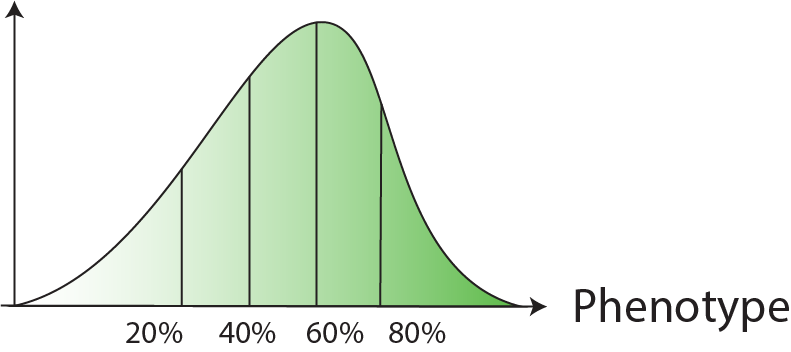

# Variant sorting screen tutorial
GWAS variant screen with per-variant gRNA tiling design, selected based on FACS signal quantiles.  

<table>
  <tr>
    <th>Library design</th>
    <td>Variant (gRNAs tile each target variant)   <br> </td>
  </tr>
  <tr>
    <th>Selection</th>
    <td>Cells are sorted based on FACS signal quantiles  <br>  </td>
  </tr>
</table>

<br></br>

## 1. Count gRNA & reporter ([`bean-count-samples`](../../README#bean-count-samples-count-reporter-screen-data))
```
screen_id=my_sorting_tiling_screen

bean-count-samples \
--input tests/data/sample_list.csv    `# Contains fastq file path; see test file for example.`\
-b A                                  `# Base A is edited (into G)` \
-f tests/data/test_guide_info.csv     `# Contains gRNA metadata; see test file for example.`\
-o ./                                 `# Output directory` \
-r                                    `# Quantify reporter edits` \
-n ${screen_id}                          `# ID of the screen to be counted`   
```
Make sure you follow the [input file format](../../README#input-file-format) for seamless downstream steps. This will produce `./bean_count_${screen_id}.h5ad`. 

## 2. QC ([`bean-qc`](../../README#bean-qc-qc-of-reporter-screen-data))
Base editing data will include QC about editing efficiency. As QC uses predefined column names and values, beware to follow the [input file guideline](../../README#input-file-format), but you can change the parameters with the full argument list of [`bean-qc`](../../README#bean-qc-qc-of-reporter-screen-data). (Common factors you may want to tweak is `--ctrl-cond=bulk` and `--lfc-conds=top,bot` if you have different sample condition labels.)
```
bean-qc \
  bean_count_${screen_id}.h5ad    `# Input ReporterScreen .h5ad file path` \
  -o bean_count_${screen_id}_masked.h5ad   `# Output ReporterScreen .h5ad file path` \
  -r qc_report_${screen_id}   `# Prefix for QC report` 
```


If the data does not include reporter editing data, you can provide `--no-editing` flag to omit the editing rate QC.


## 3. Quantify variant effect ([`bean-run`](../../README#bean-run-quantify-variant-effects))

`bean-run` can take 3 run options to quantify editing rate:  
1. From **reporter + accessibility**  
    If your gRNA metadata table (`tests/data/test_guide_info.csv` above) included per-gRNA accessibility score, 
    ```
    bean-run sorting variant \
    tests/data/bean_count_${screen_id}_masked.h5ad \
    -o tests/test_res/var/ \
    --fit-negctrl \
    --scale-by-acc \
    --accessibility-col accessibility
    ```
    If your gRNA metadata table (`tests/data/test_guide_info.csv` above) included per-gRNA chromosome & position and you have bigWig file with accessibility signal, 
    ```
    bean-run sorting variant \
    tests/data/bean_count_${screen_id}_masked.h5ad \
    -o tests/test_res/var/ \
    --fit-negctrl \
    --scale-by-acc \
    --accessibility-bw accessibility.bw
    ```

2. From **reporter**
    ```
    bean-run sorting variant \
    tests/data/bean_count_${screen_id}_masked.h5ad \
    -o tests/test_res/var/ \
    --fit-negctrl 
    ```
3. No reporter information, assume the same editing efficiency of all gRNAs.  
    Use this option if your data don't have editing rate information.
    ```
    bean-run sorting variant \
    tests/data/bean_count_${screen_id}_masked.h5ad \
    -o tests/test_res/var/ \
    --fit-negctrl \
    --uniform-edit
    ```
See [full argument list](../../README#optional-parameters) to accommodate different input sample & guide metadata columns/values and run options.